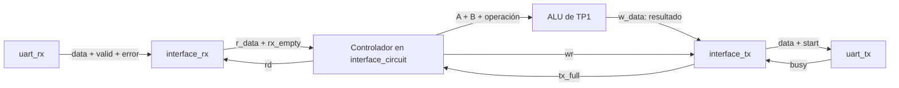

# Interfaz UART–ALU

La referencia es el diagrama de la página 21 de
`5 - Maquinas de Estado Finitas - 2019.pdf`. Se conserva su separación entre
recepción y transmisión, con las señales `r_data`, `rd`, `rx_empty`, `w_data`,
`wr` y `tx_full` entre los registros de interfaz y el controlador de la ALU.

## Archivos y responsabilidades

| Archivo | Responsabilidad |
| --- | --- |
| `src/interface_rx.v` | Guarda un byte de RX hasta que el controlador lo lee. Detecta errores y desbordamiento. |
| `src/interface_tx.v` | Guarda un resultado y coordina `start`/`busy` con TX. |
| `src/interface_circuit.v` | Instancia ambos módulos y la ALU. Su FSM carga A, B y operación, y entrega el resultado. |
| `src/ALU.v` | Copia sin modificaciones del núcleo combinacional de TP1. |



Los módulos usan `i_` para entradas, `o_` para salidas, `r_` para registros
internos y `w_` para conexiones. Las FSM siguen `r_state`, `r_next_state` y
estados definidos con `localparam`, como los archivos UART existentes.
Todo funciona con `i_clock` y reset síncrono activo en alto. El tick de baudios
se conecta únicamente a los módulos UART, no a la interfaz.

Los bloques secuenciales están separados por registro para facilitar su
seguimiento durante una simulación. En `interface_rx`, `o_r_data`, `o_rx_empty`
y `o_error` tienen cada uno su propio `always @(posedge i_clock)`. En el
controlador se separan `r_state`, `r_operand_a`, `r_operand_b` y `r_op` de la
misma manera. `interface_tx` mantiene un bloque para `r_state` y otro para
`o_data`. Ningún registro es escrito desde más de un bloque `always`.

## Protocolo elegido

El PDF muestra la conexión, pero no especifica el orden de los bytes de una
operación. Esta implementación adopta el siguiente protocolo binario:

| Byte recibido | Interpretación |
| --- | --- |
| 1 | Operando A, 8 bits. |
| 2 | Operando B, 8 bits. |
| 3 | Operación: se utilizan los bits `[5:0]`; `[7:6]` se ignoran. |
| Respuesta | Resultado de la ALU, 8 bits. |

Por ejemplo, enviar los tres bytes hexadecimales `12 34 20` produce la respuesta
`46`: `0x12 + 0x34 = 0x46`. Son bytes binarios, no los caracteres ASCII
`"12 34 20"`. Se utiliza el formato 8N1 de los módulos existentes: ocho bits,
sin paridad, un bit de stop y transmisión del bit menos significativo primero.

Las operaciones heredadas son `20` ADD, `22` SUB, `24` AND, `25` OR, `26` XOR,
`03` SRA, `02` SRL y `27` NOR (valores hexadecimales). Un código no implementado
devuelve cero, tal como hace la ALU de TP1. Los datos con signo se interpretan
en complemento a dos, el resultado conserva ocho bits y los desplazamientos
usan solamente `B[2:0]`, también por el comportamiento original de la ALU.

## Secuencia del controlador

La FSM de `interface_circuit` recorre:

```text
READ_A → READ_B → READ_OP → WRITE_RESULT → READ_A
```

Cada estado `READ_*` espera hasta que `rx_empty` sea cero. En ese momento
activa `rd` y copia el byte al registro correspondiente en el flanco ascendente.
Después de cargar la operación, pasa a `WRITE_RESULT`: la ALU dispone de un
ciclo completo para calcular con los tres registros actualizados. Si `tx_full`
vale uno, mantiene esos registros; cuando vale cero, activa `wr`, TX captura el
resultado y el controlador vuelve a esperar A.

RX tiene capacidad para un byte. Una lectura y una recepción simultáneas
consumen el byte anterior y dejan almacenado el nuevo. Si el registro está
vacío, una llegada simultánea con `rd` también queda almacenada para una
lectura posterior.

La FSM de `interface_tx` recorre:

```text
IDLE → WAIT_TX → WAIT_BUSY → WAIT_DONE → IDLE
```

`IDLE` acepta `wr` y registra el resultado. `WAIT_TX` espera `busy = 0` y
genera un único ciclo de `start`. `WAIT_BUSY` espera que TX confirme el inicio
con `busy = 1`. `WAIT_DONE` espera que `busy` vuelva a cero. Durante toda esta
secuencia, `tx_full = 1` y el dato registrado no cambia. Esto adapta el
`tx_done` dibujado en el PDF al `o_busy` que ofrece el transmisor existente.

## Conexiones con los módulos existentes

| Señal UART | Puerto de `interface_circuit` |
| --- | --- |
| `uart_rx.o_valid` | `i_rx_valid` |
| `uart_rx.o_data` | `i_rx_data` |
| `uart_rx.o_error` | `i_rx_error` |
| `uart_tx.o_busy` | `i_tx_busy` |
| `uart_tx.i_start` | `o_tx_start` |
| `uart_tx.i_data` | `o_tx_data` |

`sim/tb_uart_interface.sv` muestra esas conexiones junto con el generador de
baudios. Los pines físicos y el proyecto Vivado quedan para la integración en
placa.

## Errores y límites

`uart_rx` puede activar `o_valid` y `o_error` en el mismo ciclo. La interfaz
descarta ese byte. Si llega otro byte a un registro RX ocupado sin una lectura
simultánea, se produce un desbordamiento. En ambos casos se vacía el registro
RX, `interface_circuit.o_error` pulsa durante un ciclo y el controlador abandona
la operación en curso para volver a `READ_A`. Un resultado previamente aceptado
por la interfaz TX sigue su envío. Un reset común descarta también ese resultado.

El protocolo no tiene cabecera, delimitador ni timeout: una operación parcial
espera los bytes que faltan. Después de perder un byte no se puede reconocer
automáticamente el inicio del siguiente comando. Para recuperar una sesión
desalineada, detener el envío, aplicar reset al conjunto y reenviar los tres
bytes. `o_error` es una señal local; no se envía un byte de error por UART.

Los registros RX/TX son de un byte, no FIFOs de múltiples posiciones. El uso
más sencillo desde la PC es enviar una operación y esperar su respuesta antes
de enviar la siguiente. No hay control de flujo serial para frenar al emisor.

## Simulación

Desde la carpeta `TP2_UART`, con Icarus Verilog instalado:

```bash
tp2_sim_dir=$(mktemp -d /tmp/tp2_interface.XXXXXX)
for bench in tb_interface_rx tb_interface_tx tb_interface_circuit tb_uart_interface; do
    iverilog -g2012 -s "$bench" -o "$tp2_sim_dir/$bench.vvp" \
        src/ALU.v src/interface_rx.v src/interface_tx.v src/interface_circuit.v \
        src/baud_gen.v src/uart_rx.v src/uart_tx.v "sim/$bench.sv" || break
    vvp "$tp2_sim_dir/$bench.vvp" || break
done
```

Las pruebas individuales cubren lectura/escritura simultánea, ocupación de TX,
pulso único de inicio, errores y reset. La prueba del controlador comprueba las
ocho operaciones, comandos incompletos y resultados pendientes. La prueba UART
conecta los módulos originales, envía tramas seriales y decodifica las respuestas
con un monitor independiente; acelera únicamente el baud rate para simular.
