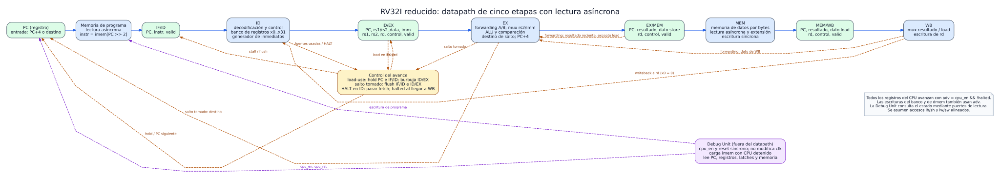

# Datapath del procesador RISC-V segmentado

Este documento explica el [diagrama del datapath](datapath.svg) del trabajo final. Describe **qué hace cada bloque, qué información conserva cada registro intermedio y por qué existen los caminos de retorno y las señales de control**. Es una descripción de arquitectura previa al código RTL: donde la consigna y el diagrama todavía no fijan una política concreta, se indica expresamente.



## 1. Alcance y lectura del dibujo

El procesador implementará el subconjunto de 32 instrucciones RV32I pedido por la cátedra (aritmética, lógica, cargas, stores, `beq`, `bne`, `jal`, `jalr` y `lui`), más una instrucción de parada cuya codificación aún debemos elegir. RV32I significa registros y direcciones de **32 bits**. Las instrucciones tienen **32 bits** y, en este subconjunto, cada instrucción ocupa **4 bytes**.

La línea azul superior es el recorrido principal de una instrucción: **IF → ID → EX → MEM → WB**. Los bloques verdes son registros físicos: PC y los cuatro registros intermedios. Los bloques azules calculan una función de sus entradas durante el ciclo. Las líneas discontinuas son caminos de retorno o control: no representan una instrucción retrocediendo de etapa. Los bloques amarillo y violeta representan, respectivamente, el control de riesgos y la Debug Unit.

El pipeline permite que varias instrucciones estén activas simultáneamente, cada una en una etapa distinta. Una instrucción no completa las cinco etapas en un único ciclo: avanza al siguiente registro intermedio en cada flanco habilitado. Una vez lleno el pipeline, idealmente puede terminar una instrucción por ciclo; los stalls y los saltos reducen ese ritmo.

> **Decisión acordada:** memorias pequeñas con lectura asíncrona. La dirección cambia durante un ciclo y, después del retardo combinacional, aparece el dato en ese mismo ciclo. Las escrituras siguen ocurriendo en un flanco de clock. Esto permite representar IF y MEM como en el pipeline clásico de cinco etapas. La capacidad exacta de cada memoria todavía debe fijarse.

## 2. Clock, avance y significado de «un paso»

Todo el sistema usa el mismo clock de la FPGA. La Debug Unit **no corta, combina ni genera pulsos de clock** para mover al CPU. En cambio, entrega `cpu_en`. Definimos conceptualmente:

```text
adv = cpu_en && !halted
```

Cuando `adv = 1`, el PC y los registros intermedios pueden actualizarse en el siguiente flanco. Cuando `adv = 0`, conservan su estado. También se condicionan con `adv` las escrituras arquitectónicas: banco de registros y memoria de datos. Así, pausar el CPU no repite un store ni una escritura de registro. El reset síncrono tiene prioridad sobre `adv` y permite salir del estado `halted` para ejecutar otro programa.

**Un paso avanza un ciclo de pipeline, no una instrucción completa.** Si una instrucción está en ID y otra en MEM, ambas avanzan a la vez con ese paso. En el siguiente paso la primera estará en EX y la segunda en WB, salvo que intervenga un stall, flush o HALT. Esta distinción será importante en la interfaz de usuario.

## 3. IF: búsqueda de instrucción

### PC y selección del próximo PC

El **program counter** (`PC`) guarda la dirección en bytes de la instrucción que se busca. Durante la ejecución normal, el candidato siguiente es `PC + 4`, porque cada instrucción ocupa cuatro bytes. Si EX determina que corresponde un salto, se selecciona su **destino** en lugar de `PC + 4`. Si hay un stall o se detuvo el fetch por HALT, el PC conserva su valor. La prioridad concreta de reset, salto y stall se fijará en la lógica de control; un salto válido de una instrucción anterior debe poder descartar un HALT especulativo posterior.

El «PC» del dibujo reúne el registro y la selección de su entrada. Al bajar a RTL, probablemente se verán como el registro `pc_if`, un sumador `+4` y un multiplexor `pc_next`.

### Memoria de programa (`imem`)

La memoria recibe una dirección de instrucción. Como cada entrada guarda una palabra de 32 bits, la lectura conceptual es `imem[PC >> 2]`: los dos bits menos significativos de una dirección alineada valen cero. El dato sale de forma combinacional. La Debug Unit dispondrá de **un camino de escritura independiente** para cargar el programa por UART mientras el CPU esté detenido. Cargar otro programa no exige resintetizar la FPGA.

Aún debemos definir el tamaño, el comportamiento de una dirección fuera de rango y cómo impedir que queden instrucciones antiguas accesibles después de cargar un programa más corto. Estas decisiones importan especialmente si el programa no contiene HALT.

### IF/ID

En el flanco habilitado, el registro `IF/ID` captura el **PC de la instrucción**, sus 32 bits y un bit `valid`. Ese PC debe acompañar a la instrucción: más adelante se usa para `PC + 4`, destinos relativos de branch/`jal` y para mostrar dónde está cada instrucción.

`valid = 0` identifica una **burbuja**: la etapa no contiene una instrucción que pueda producir efectos. Un flush invalida la instrucción que estaba entrando; un stall conserva la que ya estaba en IF/ID. Poner una codificación `nop` en el campo de instrucción ayuda a leer las ondas, pero el bit `valid` es la autoridad para saber si la etapa está ocupada.

## 4. ID: decodificación y lectura de operandos

La etapa ID interpreta los campos de la instrucción: `opcode`, `funct3`, `funct7`, `rd`, `rs1` y `rs2`, según su formato. Tres subbloques trabajan en paralelo:

1. **Decodificador/control.** Determina qué operación realizará EX, si la instrucción usa `rs1` o `rs2`, si leerá/escribirá memoria, si escribirá `rd`, si es branch, jump o HALT. Las señales que producirían efectos se anulan cuando `valid = 0`.
2. **Banco de registros.** Contiene 32 registros de 32 bits. Dos puertos permiten leer `rs1` y `rs2`; un puerto permite escribir `rd` en WB. `x0` siempre se lee como cero e ignora escrituras. Habrá un puerto de lectura adicional para depuración. Si WB escribe un registro que ID lee en el mismo ciclo, un bypass local deberá ofrecer el dato nuevo sin recurrir a un flanco negativo del clock.
3. **Generador de inmediatos.** Reconstruye y extiende a 32 bits el inmediato de los formatos I, S, B, J o U. En B y J los bits del desplazamiento están repartidos dentro de la instrucción; el generador los reordena y coloca el bit bajo cero. En I/S/B/J, el bit 31 de la instrucción determina la extensión de signo. Para `lui`, los 20 bits altos se colocan en `[31:12]` y los 12 bajos son cero.

Las señales `uses_rs1` y `uses_rs2` son necesarias para detectar riesgos reales. No basta comparar números de campos: en algunas instrucciones los bits que ocuparían `rs2` forman parte de un inmediato y no designan un registro leído.

### ID/EX

`ID/EX` conserva el PC, los dos operandos leídos, el inmediato, los identificadores `rs1`, `rs2`, `rd`, las señales de control y `valid`. Llevar los identificadores permite que la unidad de forwarding compare dependencias en EX. Si el control inserta una burbuja, deben quedar apagadas `reg_write`, `mem_write`, `branch`, `jump`, `halt` y cualquier otra señal con efecto. Los valores numéricos de una burbuja pueden ser irrelevantes, pero su control y `valid` no.

## 5. EX: cálculo, forwarding y saltos

### Selección de operandos

EX necesita dos valores actuales. Antes de usarlos, los multiplexores de **forwarding** pueden sustituir cada valor antiguo de `ID/EX`:

- Desde `EX/MEM`, cuando una instrucción anterior ya calculó su resultado. Esta vía **no entrega el dato de un load**, que aún no estaba disponible al salir de EX.
- Desde `MEM/WB`, cuando el resultado ya está listo para escribirse, incluido el dato de un load.
- Del valor guardado en `ID/EX`, si no existe una dependencia más reciente.

Si ambas vías coinciden con el mismo registro destino, gana `EX/MEM`: corresponde a la instrucción más nueva. Nunca se reenvía una escritura destinada a `x0`.

El forwarding se aplica **antes** de elegir entre el segundo registro y el inmediato para la ALU. Así el valor actualizado de `rs2` también sirve como dato de `store` y para comparar en `beq`/`bne`. Por ejemplo, `addi x5,x0,7` seguido de `sw x5,0(x0)` debe escribir 7.

### ALU y resultado

La ALU realizará suma, resta, desplazamientos lógicos y aritméticos, AND, OR, XOR y comparaciones con y sin signo. El desplazamiento toma los cinco bits bajos de la cantidad; una comparación con signo no equivale a una comparación entre palabras sin signo. En cargas y stores, la ALU suma `rs1 + inmediato` para obtener la dirección efectiva.

El resultado que avanza hacia `EX/MEM` puede venir de distintos cálculos:

- Aritmética/lógica: salida de la ALU.
- `lui`: inmediato U (equivalente a sumar cero + inmediato).
- `jal`/`jalr`: **PC de esa instrucción + 4**, que se escribe en `rd` como dirección de retorno.

Un único campo «resultado» simplifica las etapas posteriores y el forwarding. La operación exacta de la ALU debe decodificarse según el tipo de instrucción: el bit 30 distingue `sub` de `add` en tipo R, pero en `addi` puede ser simplemente parte de un inmediato negativo.

### Branch y jump

`beq` y `bne` comparan los operandos ya corregidos por forwarding. Si se toma un branch, el destino es **PC de la instrucción en EX + inmediato B**. `jal` también usa **PC + inmediato J**. `jalr` usa **(`rs1` reenviado + inmediato I) & ~1**; limpia el bit cero del destino. `jal` no salta a la dirección guardada en `rd`: guarda allí la dirección de retorno.

Resolver saltos en EX simplifica la comparación y el forwarding, pero cuando se conoce la decisión ya pudieron entrar dos instrucciones posteriores. Si se toma el salto, se invalidan IF/ID e ID/EX; ninguna de esas instrucciones puede escribir registros o memoria.

### EX/MEM

Conserva PC, resultado, dato de `store` ya reenviado, `rd`, control y `valid`. El dato de `store` debe viajar por separado de la dirección: en `sw x5,0(x1)`, la ALU calcula la dirección a partir de `x1`, mientras que la memoria escribe el valor de `x5`.

## 6. MEM: acceso a memoria de datos

La memoria de datos se organiza como palabras de 32 bits con **cuatro carriles de byte**. La dirección calculada en EX selecciona una palabra y, mediante sus bits `[1:0]`, un byte dentro de ella. Una lectura entrega combinacionalmente la palabra durante MEM; luego se selecciona y extiende el fragmento solicitado:

| Instrucción | Datos devueltos |
|---|---|
| `lb` / `lh` | Byte / media palabra extendidos con signo a 32 bits |
| `lbu` / `lhu` | Byte / media palabra extendidos con ceros |
| `lw` | Palabra completa de 32 bits |

Los stores escriben en el flanco y habilitan solo los carriles correspondientes: uno para `sb`, dos para `sh`, cuatro para `sw`. La escritura requiere `adv`, `valid` y `mem_write`. Se asume el orden **little-endian** de RISC-V: el byte de menor peso se ubica en la dirección menor.

El dibujo supone accesos alineados: `lh`/`sh` en direcciones pares y `lw`/`sw` en múltiplos de cuatro. **Todavía no fijamos la respuesta ante un acceso desalineado**; no se debe interpretar este dibujo como una promesa de ignorar silenciosamente los bits bajos. También falta definir la capacidad, el valor inicial de la RAM y el mecanismo concreto para identificar la «memoria usada» que se enviará a la PC. Una posibilidad es marcar con un bit `dirty` cada palabra escrita, pero no es una decisión tomada.

### MEM/WB

Conserva PC, el resultado procedente de EX, el dato leído/extendido de memoria, `rd`, el control necesario para WB y `valid`. Se transportan ambos valores porque WB elegirá cuál corresponde a la instrucción. Si no hay load, el dato leído es irrelevante; si sí lo hay, la selección debe tomarlo.

## 7. WB: resultado arquitectónico

Un multiplexor escoge entre el **resultado de EX** y el **dato del load**. Si `valid`, `reg_write` y `adv` lo permiten, escribe ese valor en `rd` durante el flanco. Las instrucciones `store`, branch y HALT no escriben el banco. `x0` continúa valiendo cero incluso si una instrucción lo nombra como destino.

La flecha de WB a ID representa esa escritura y el bypass local del banco. La flecha de WB a EX representa forwarding: el mismo dato que se escribirá puede ser necesario para una instrucción más joven que ya está en EX.

## 8. Unidad de riesgos y control del avance

Esta unidad observa lo que hay en las etapas y decide **qué se actualiza** en el próximo flanco. Hay tres situaciones principales:

| Situación | PC | IF/ID | ID/EX | Instrucciones más antiguas |
|---|---|---|---|---|
| Avance normal | `PC + 4` | Captura la siguiente | Captura lo decodificado | Avanzan |
| Dependencia inmediata de un load | Conserva PC | Conserva su instrucción | Introduce burbuja | El load y las anteriores avanzan |
| Salto tomado en EX | Carga destino | Se invalida | Se invalida | El salto y las anteriores avanzan |
| HALT válido en ID | Deja de buscar nuevas | Se invalida mientras drena | HALT avanza una vez | Las anteriores terminan |

**Load-use.** Si en EX hay un load que escribirá `rd`, y la instrucción válida en ID realmente usa ese registro como `rs1` o `rs2`, forwarding no alcanza: el dato de memoria aparece durante MEM, demasiado tarde para el EX inmediato de la consumidora. Se retienen PC e IF/ID un ciclo y se inserta una burbuja en ID/EX. Al ciclo siguiente, el dato puede venir desde MEM/WB. Una dependencia a distancia mayor suele resolverse con forwarding o con el bypass del banco.

**Flush por salto.** Cuando EX decide tomar un branch o ejecutar `jal`/`jalr`, el PC recibe el destino y se invalidan las instrucciones jóvenes. El salto sigue avanzando; no se «rebobina» ninguna instrucción antigua.

**HALT y drenado.** La codificación de HALT sigue pendiente. La idea es reconocerla en ID, impedir nuevas entradas y dejarla recorrer EX, MEM y WB sin efectos sobre registros ni memoria. Cuando HALT llega válidamente a WB, las instrucciones anteriores ya terminaron; los registros intermedios anteriores deben tener `valid = 0`, y se activa `halted`. Si un salto más antiguo tomado descarta ese HALT antes de comprometerlo, el CPU no debe detenerse.

La prioridad de señales debe implementarse y probarse de forma explícita. Conceptualmente, **reset > actualización habilitada > resolución de salto/flush > stall ordinario**; el caso de HALT especulativo detrás de un salto exige que el salto gane. Esta frase expresa una regla de diseño, no sustituye la tabla de verdad detallada que haremos al codificar.

## 9. Debug Unit y carga de programa

La Debug Unit está fuera del datapath principal, pero lo controla y lo observa. Recibe comandos por UART desde la PC para:

- Escribir palabras en la memoria de programa con el CPU detenido.
- Emitir un pulso de reset del CPU y decidir cuándo `cpu_en` vale 1.
- Leer el PC, los 32 registros, los campos de IF/ID, ID/EX, EX/MEM y MEM/WB, y la memoria de datos utilizada.
- Informar `halted` y devolver el estado tras cada paso o al acabar la ejecución continua.

El dibujo resume esos puertos para mantener legible el recorrido principal. No muestra byte por byte el protocolo UART; ese contrato debe documentarse aparte. En modo continuo se necesita además un límite o mecanismo de recuperación si el programa no alcanza HALT, para que la interfaz no espere para siempre.

**Reprogramar** exige, como mínimo, impedir que queden instrucciones antiguas en vuelo: resetear PC y registros intermedios antes de arrancar el programa nuevo. Si también se limpian registros generales, memoria de datos, marcas de uso y posiciones sobrantes de la memoria de programa es una política que debemos fijar antes de implementar la carga. El reset del CPU del diagrama **no implica** borrar automáticamente `imem`.

## 10. Ejemplo temporal breve

Para `addi x1,x0,5` seguida de `add x2,x1,x1`, sin stalls y suponiendo que ambas instrucciones son válidas:

| Ciclo | Primera instrucción | Segunda instrucción | Punto importante |
|---|---|---|---|
| 1 | IF | — | Se busca `addi` |
| 2 | ID | IF | `addi` lee `x0` |
| 3 | EX | ID | `addi` calcula 5; `add` aún puede leer el valor viejo de `x1` |
| 4 | MEM | EX | Forwarding desde EX/MEM sustituye ambos operandos de `add` por 5 |
| 5 | WB | MEM | Se escribe `x1 = 5` |
| 6 | — | WB | Se escribe `x2 = 10` |

Si la primera fuese `lw x1,0(x0)`, en el ciclo 3 `add` no podría pasar a EX inmediatamente: habría un ciclo de stall. El dato del load se obtendría en MEM y luego llegaría a EX mediante la vía de MEM/WB.

## 11. Decisiones que aún revisaremos juntos

Estas cuestiones aparecen en el diagrama o afectan su implementación, pero **no están cerradas**:

1. Capacidad de `imem` y `dmem`, y comportamiento de direcciones fuera de rango.
2. Codificación de HALT y tratamiento de instrucciones ilegales.
3. Política para accesos de datos desalineados.
4. Qué se limpia al cargar un programa nuevo y cómo se evita ejecutar restos del programa anterior.
5. Mapa exacto del puerto de depuración y de las palabras de cada latch.
6. Protocolo UART, formato del dump y límite de ciclos sin HALT.
7. Mecanismo para identificar y mostrar la memoria de datos usada.

Las decisiones ya fijadas para este dibujo son: **pipeline de cinco etapas**, **saltos resueltos en EX**, **forwarding y stall load-use**, **un solo clock con habilitación**, y **memorias pequeñas de lectura asíncrona**. La síntesis y la temporización de Vivado permitirán comprobar más adelante si el tamaño elegido es apropiado.
