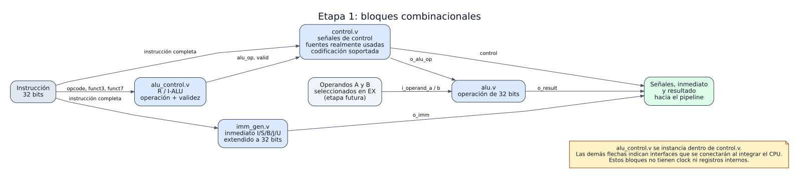

# 01 — Bloques combinacionales

Esta guía explica **todo lo implementado en la etapa 1** del procesador RISC-V: constantes compartidas, ALU de 32 bits, selección de su operación, generación de inmediatos y control de instrucciones. Se puede leer antes del [datapath completo](00_datapath.md); aquí todavía no hay PC, memorias, banco de registros ni registros de pipeline implementados.



[Ver SVG ampliable](../diagramas/01_combinacionales.svg) · [Ver fuente PlantUML](../diagramas/01_combinacionales.puml)

> **Cómo leer el dibujo:** `control.v` **sí instancia** `alu_control.v` en el RTL actual. Las demás flechas representan las entradas, salidas y conexiones previstas cuando integremos el CPU. Por ejemplo, la ALU existe y funciona sola, pero todavía no hay un módulo EX que conecte sus operandos y la señal `o_alu_op`.

## 1. Basicos para comprender el combinacional

Un circuito combinacional no guarda un valor de un ciclo al siguiente. Si cambian sus entradas, su salida se recalcula tras un retardo físico. Por eso ninguno de estos cuatro módulos tiene `clock`, `reset` ni `always @(posedge ...)`. En simulación se describen con `always @(*)`, asignaciones bloqueantes `=` y valores por defecto para todas las salidas. Los valores por defecto impiden inferir *latches*, que sí guardarían estado y serían inesperados aquí.

La información se conservará en los registros IF/ID, ID/EX y siguientes cuando implementemos el pipeline. Esta etapa prepara la lógica que se colocará **entre** esos registros.

## 2. Ubicación y origen del código

Las fuentes están en [`VIVADO/TP_FINAL/rtl`](../../VIVADO/TP_FINAL/rtl/) y los testbenches en [`VIVADO/TP_FINAL/tb`](../../VIVADO/TP_FINAL/tb/). Ambos conjuntos, incluido el encabezado, están registrados en [`TP_FINAL.xpr`](../../VIVADO/TP_FINAL/TP_FINAL.xpr).

| Archivo | Qué entrega |
|---|---|
| [`riscv_defs.vh`](../../VIVADO/TP_FINAL/rtl/riscv_defs.vh) | Nombres compartidos para opcodes, variantes de `funct7`, operaciones internas de ALU y HALT. |
| [`alu.v`](../../VIVADO/TP_FINAL/rtl/alu.v) | Resultado de una operación de 32 bits sobre dos operandos. |
| [`alu_control.v`](../../VIVADO/TP_FINAL/rtl/alu_control.v) | Operación interna de ALU y validez de instrucciones R o ALU-inmediatas. |
| [`imm_gen.v`](../../VIVADO/TP_FINAL/rtl/imm_gen.v) | Inmediato de 32 bits reconstruido desde una instrucción. |
| [`control.v`](../../VIVADO/TP_FINAL/rtl/control.v) | Señales que describen qué hace una instrucción y qué recursos necesita. |

La ALU se adaptó a partir de [TP1_ALU](../../../TP1_ALU/src/ALU.v). Ese trabajo era parametrizable y se probó con 8 bits; aportó ADD, SUB, AND, OR, XOR, SRL y SRA. La versión nueva usa 32 bits y añade SLL, SLT y SLTU. Los archivos de TP1 no se modificaron. TP2_UART se reutilizará en una etapa posterior; sus módulos no participan en estos cálculos.

La convención de nombres conserva la de los trabajos previos: `i_` para entradas, `o_` para salidas, `w_` para conexiones internas y `r_` para variables de estímulo de los testbenches. Las constantes están en mayúsculas.

## 3. La instrucción de 32 bits y sus campos

El control ve la palabra completa `i_instr[31:0]`. Según el formato, no todos los bits significan lo mismo. Los campos habituales son:

| Campo | Bits | Uso |
|---|---:|---|
| `opcode` | `[6:0]` | Familia de la instrucción: R, inmediata, load, store, branch, jump o LUI. |
| `rd` | `[11:7]` | Registro destino cuando la instrucción escribe uno. |
| `funct3` | `[14:12]` | Subtipo dentro de la familia. |
| `rs1` | `[19:15]` | Primer registro fuente cuando se usa. |
| `rs2` | `[24:20]` | Segundo registro fuente en R, store y branch. |
| `funct7` | `[31:25]` | Diferencia algunas operaciones R y desplazamientos inmediatos. |

**Los campos no deben interpretarse fuera de su formato.** En `addi`, los bits `[31:20]` son un inmediato; aunque `[31:25]` ocupen la posición de `funct7`, no son una orden de resta. En un load, `[24:20]` es parte de su desplazamiento, no un `rs2` leído.

El subconjunto solicitado suma 32 instrucciones: 10 de tipo R, 9 aritméticas inmediatas, 5 loads, 3 stores, 2 branches, `jal`, `jalr` y `lui`. HALT se añade como instrucción propia del proyecto.

## 4. `riscv_defs.vh`: constantes compartidas

El encabezado asocia nombres a los opcodes RISC-V, a `funct7 = 0000000` y `0100000`, y a diez códigos **internos** de ALU de 4 bits. Por ejemplo, `ALU_ADD` identifica una operación dentro del hardware; **no es** el opcode RISC-V de `add`. Distintas instrucciones necesitan la misma suma: `add`, `addi`, loads y stores.

Los módulos lo incorporan con `include`. También fija `RISCV_HALT_INSTR = 32'h0000_0073`. Mantener estos valores en un solo lugar evita que dos módulos asignen códigos diferentes a una misma operación. El proyecto incluye la ruta `rtl` para encontrar el encabezado.

## 5. `alu.v`: unidad aritmética y lógica

### Interfaz

| Puerto | Dirección y tamaño | Función |
|---|---|---|
| `i_operand_a` | Entrada, 32 bits | Primer operando. |
| `i_operand_b` | Entrada, 32 bits | Segundo operando o inmediato ya seleccionado por un mux futuro. |
| `i_op` | Entrada, 4 bits | Operación interna elegida. |
| `o_result` | Salida, 32 bits | Resultado de la operación. |

La ALU no conoce instrucciones RISC-V, registros, PC ni memoria. Solo recibe dos palabras y una operación. La selección entre `rs2` e inmediato, y el forwarding, pertenecerán a la etapa EX del pipeline.

### Operaciones

| Código interno | Cálculo | Caso que conviene recordar |
|---|---|---|
| `ALU_ADD` | `a + b` | `0xFFFFFFFF + 1 = 0` en 32 bits. |
| `ALU_SUB` | `a - b` | `0 - 1 = 0xFFFFFFFF`. |
| `ALU_SLL` | `a << b[4:0]` | `1 << 31 = 0x80000000`. |
| `ALU_SRL` | `a >> b[4:0]` | Desplaza a derecha e introduce ceros. |
| `ALU_SRA` | `$signed(a) >>> b[4:0]` | Conserva el signo: `0x80000000 >>> 31 = 0xFFFFFFFF`. |
| `ALU_AND` | `a & b` | AND bit a bit. |
| `ALU_OR` | `a | b` | OR bit a bit. |
| `ALU_XOR` | `a ^ b` | XOR bit a bit. |
| `ALU_SLT` | `$signed(a) < $signed(b)` | `0x80000000 < 1` es verdadero con signo. |
| `ALU_SLTU` | `a < b` sin signo | La misma comparación es falsa sin signo. |

La salida de SLT/SLTU es la palabra `0x00000001` o `0x00000000`. Los desplazamientos toman solo cinco bits de la cantidad; por ello desplazar por 32 equivale, en estas instrucciones RV32I, a desplazar por 0. La suma y resta conservan los 32 bits bajos: no se añadió una excepción de overflow. Para un `i_op` no definido, la salida queda en cero.

**Por qué SRA tiene un tratamiento distinto:** en Verilog un `>>` lógico completa con ceros. `>>>` realiza extensión de signo solamente si el operando izquierdo se interpreta como signed. El cast `$signed(i_operand_a)` hace explícito ese requisito. SLT también fuerza comparación con signo; SLTU conserva la comparación sin signo.

## 6. `alu_control.v`: traducción a operaciones de ALU

### Interfaz y ubicación

Recibe `i_opcode[6:0]`, `i_funct3[2:0]` e `i_funct7[6:0]`. Entrega `o_alu_op[3:0]` y `o_valid`. `control.v` lo instancia y usa sus salidas para las instrucciones R y ALU-inmediatas. Para otros opcodes, `o_valid = 0`; eso **no** significa que un load sea ilegal, sino que la validez completa la decide `control.v`.

### Tabla de decodificación aritmética

| Instrucción | Familia | `funct3` | `funct7` exigido | Operación |
|---|---|---|---|---|
| `add` / `sub` | R | 000 | 0000000 / 0100000 | ADD / SUB |
| `sll`, `slt`, `sltu`, `xor`, `or`, `and` | R | 001, 010, 011, 100, 110, 111 | 0000000 | Operación homónima |
| `srl` / `sra` | R | 101 | 0000000 / 0100000 | SRL / SRA |
| `addi`, `slti`, `sltiu`, `xori`, `ori`, `andi` | I-ALU | 000, 010, 011, 100, 110, 111 | No se consulta | ADD, SLT, SLTU, XOR, OR, AND |
| `slli` | I-ALU | 001 | 0000000 | SLL |
| `srli` / `srai` | I-ALU | 101 | 0000000 / 0100000 | SRL / SRA |

La tabla muestra por qué separar `alu_control` de la ALU: **la ALU no necesita saber de qué formato vino la operación**. También muestra una validación importante: no se acepta cualquier patrón con opcode R o I-ALU. Una variante R con `funct7 = 0000001` (extensión M, no pedida) entrega `o_valid = 0`.

### Por qué aquí se usa `casez`

El decodificador usa `casez` sobre `{opcode, funct3, funct7}`. Solo seis entradas I-ALU (`addi`, `slti`, `sltiu`, `xori`, `ori`, `andi`) contienen `7'b???????`: esos siete bits son parte de un inmediato arbitrario y **no deben filtrar la operación**. Los diez patrones R y los tres desplazamientos inmediatos comparan `funct7` completo; una variante no solicitada sigue cayendo en `default` con `o_valid = 0`.

`casez` también podría tratar un `Z` inesperado en la entrada como comodín. Para que eso no oculte un problema en simulación, antes del `casez` se comprueba la reducción XOR de los tres campos: si contiene `X` o `Z`, se conservan las salidas por defecto (`o_valid = 0`, `o_alu_op = ALU_ADD`). Con entradas binarias completas, esa condición siempre permite decodificar. No se usa `casex`, que ignoraría además los `X` en la comparación.

La conversión se comparó con el decodificador anterior para las **131 072 combinaciones binarias** posibles de los tres campos. No hubo diferencias: se aceptan **781 patrones** (10 R exactos y 771 I-ALU, de los cuales 768 son las seis operaciones con inmediato libre). Se añadieron pruebas permanentes de `X` y `Z` para evitar que una instrucción incompleta se marque válida.

Ejemplo: `addi x3,x1,-1` se codifica como `0xFFF08193`. Sus bits altos valen 1 porque el inmediato es negativo. `alu_control` mira `funct3 = 000` y selecciona **ADD**, sin interpretar esos bits como la variante SUB. `imm_gen` entrega `0xFFFFFFFF`, que representa `-1` en complemento a dos.

## 7. `imm_gen.v`: reconstrucción de inmediatos

### Interfaz

Recibe `i_instr[31:0]` y entrega `o_imm[31:0]`. No suma PC ni lee registros. Usa el opcode para seleccionar cómo reorganizar los bits.

| Formato y uso | Bits que forman el valor antes de extenderlo | Ejemplo |
|---|---|---|
| I: ALU-inmediata, load, `jalr` | `instr[31:20]` | `0xFFF00093` → `-1` |
| S: store | `{instr[31:25], instr[11:7]}` | `0xFE20A823` → `-16` |
| B: `beq`, `bne` | `{instr[31], instr[7], instr[30:25], instr[11:8], 1'b0}` | `0xFE208EE3` → `-4` |
| J: `jal` | `{instr[31], instr[19:12], instr[20], instr[30:21], 1'b0}` | `0x008000EF` → `8` |
| U: `lui` | `{instr[31:12], 12'b0}` | `0x123450B7` → `0x12345000` |

**Extender el signo** significa copiar el bit de signo en los bits altos hasta obtener 32 bits. Por ejemplo, un inmediato I `0xFFF` representa `-1`, por lo que se entrega `0xFFFFFFFF`, no `0x00000FFF`. B y J agregan un cero al extremo inferior de su desplazamiento; los bits de sus inmediatos están repartidos en la instrucción y deben reordenarse.

Para un opcode sin formato de inmediato soportado, `o_imm = 0`. `imm_gen` no valida `funct3`: podría producir un inmediato para una codificación cuyo opcode es de load pero cuyo subtipo es ilegal. El control general impedirá que esa codificación tenga efectos.

## 8. `control.v`: señales para el datapath

### Qué entra y qué sale

La entrada es `i_instr[31:0]`. Dentro del módulo se extraen `opcode`, `funct3` y `funct7`; `alu_control.v` entrega la operación para R e I-ALU. En todas las ramas se parte de salidas en cero. Solo una instrucción reconocida habilita efectos.

| Salida | Qué indica y dónde se usará |
|---|---|
| `o_alu_op[3:0]` | Operación interna que ejecutará la ALU en EX. |
| `o_alu_src_b` | EX elige el inmediato como segundo operando de ALU. |
| `o_reg_write` | WB podrá escribir `rd` si la instrucción sigue siendo válida. |
| `o_mem_read` | La instrucción es un load; la unidad de riesgos también lo necesitará. |
| `o_mem_write` | MEM podrá escribir en memoria de datos. |
| `o_mem_to_reg` | WB debe elegir el dato leído de memoria en vez del resultado de EX. |
| `o_branch` | EX evaluará la condición de `beq` o `bne`. `funct3` deberá viajar con la instrucción. |
| `o_jump` | EX redirigirá el PC y producirá `PC+4` para `rd`. |
| `o_jalr` | Distingue `jalr` de `jal`: el destino usa `rs1 + imm` y limpia el bit cero. |
| `o_lui` | EX debe usar cero como operando A para producir el inmediato U. |
| `o_halt` | La instrucción es el HALT exacto del proyecto. |
| `o_uses_rs1`, `o_uses_rs2` | La instrucción realmente lee esos registros; evita stalls falsos. |
| `o_valid_instr` | La palabra tiene una codificación soportada por este subconjunto. |

`o_valid_instr` **no es** el bit `valid` de IF/ID o ID/EX. El primero habla de la codificación. El segundo hablará de si una etapa contiene una instrucción real o una burbuja tras un flush/stall.

### Efectos por familia

| Familia | Señales principales activas |
|---|---|
| R | `reg_write`, `uses_rs1`, `uses_rs2`; operación desde `alu_control`. |
| I-ALU | `alu_src_b`, `reg_write`, `uses_rs1`; operación desde `alu_control`. |
| Load | `alu_src_b`, `reg_write`, `mem_read`, `mem_to_reg`, `uses_rs1`; ALU suma dirección base + inmediato. |
| Store | `alu_src_b`, `mem_write`, `uses_rs1`, `uses_rs2`; ALU suma dirección base + inmediato. |
| `beq` / `bne` | `branch`, `uses_rs1`, `uses_rs2`; EX compara ambos operandos. |
| `jal` | `jump`, `reg_write`; destino relativo al PC. |
| `jalr` | `jump`, `jalr`, `reg_write`, `alu_src_b`, `uses_rs1`. |
| `lui` | `lui`, `alu_src_b`, `reg_write`; EX usa cero + inmediato U. |
| HALT | `halt`; no habilita escritura de registros ni memoria. |

La salida `o_alu_op` queda en ADD para instrucciones cuyo resultado de ALU no depende de `funct3` o no se usa. Por ejemplo, un load necesita sumar una dirección. Un branch tendrá una comparación específica en EX: su `o_alu_op = ADD` por defecto **no** indica que `beq` compare mediante esa suma.

Para `lui`, `o_alu_src_b = 1` seleccionará el inmediato y `o_lui = 1` hará que EX tome cero como operando A. `control.v` no realiza ese mux todavía; solamente emite las señales para implementarlo después.

### Instrucciones no soportadas y HALT

Los subtipos de load, store, branch y `jalr` se filtran por `funct3`. Las R y ALU-inmediatas se filtran también mediante `alu_control`. Ante una codificación no soportada, `o_valid_instr = 0` y todas las señales con efectos quedan en cero. Todavía **no hay unidad de excepciones** ni un comportamiento final decidido para un programa con instrucciones ilegales.

El HALT elegido es la palabra exacta `0x00000073` (`ECALL`). En este proyecto se interpretará como parada del CPU, no como una llamada a un sistema operativo. Otras palabras del opcode SYSTEM no se aceptan como HALT. El reconocimiento completo de la palabra impide que una instrucción SYSTEM distinta detenga el procesador accidentalmente. La lógica que detendrá el fetch y vaciará el pipeline pertenece a una etapa posterior.

## 9. Recorrido completo de un ejemplo

Supongamos la instrucción `addi x3,x1,-1`, codificada como `0xFFF08193`, y que `x1 = 5` cuando se ejecute:

1. `control.v` reconoce opcode I-ALU y consulta a `alu_control.v`.
2. `alu_control.v` selecciona `ALU_ADD` y marca válida la codificación. El bit 30 no convierte `addi` en SUB.
3. `control.v` activa `o_alu_src_b`, `o_reg_write`, `o_uses_rs1` y `o_valid_instr`; no activa `o_uses_rs2` ni memoria.
4. `imm_gen.v` reconstruye `o_imm = 0xFFFFFFFF` (`-1`).
5. Cuando exista EX, su mux presentará `5` como operando A y `0xFFFFFFFF` como B. La ALU entregará `4` en 32 bits.
6. Cuando existan las etapas siguientes, WB escribirá `4` en `x3`.

**Hoy se pueden verificar los pasos 1–4 y el cálculo de la ALU por separado.** Los pasos 5–6 describen la integración futura; no hay todavía una ejecución de instrucciones completas en este proyecto.

Un segundo ejemplo, `srai x3,x1,2` (`0x4020D193`), usa `funct3 = 101` y la variante `funct7 = 0100000`; por eso `alu_control` elige SRA. En cambio, para `addi` la parte alta del inmediato se ignora al escoger la operación.

## 10. Verificación realizada

Los testbenches son independientes, usan valores esperados concretos y terminan con error si una salida no coincide:

| Testbench | Comprobaciones | Cobertura principal |
|---|---:|---|
| [`tb_alu.sv`](../../VIVADO/TP_FINAL/tb/tb_alu.sv) | 21 | Diez operaciones, extremos de 32 bits, desplazamientos de 0/31/32, signo frente a sin signo y código interno inválido. |
| [`tb_imm_gen.sv`](../../VIVADO/TP_FINAL/tb/tb_imm_gen.sv) | 13 | Los cinco formatos, inmediatos positivos/negativos y opcode sin inmediato. |
| [`tb_control.sv`](../../VIVADO/TP_FINAL/tb/tb_control.sv) | 47 | Las 32 instrucciones solicitadas, HALT, diez codificaciones no soportadas y cuatro entradas con `X`/`Z`. |

**Resultado:** 81/81 comprobaciones pasaron con Icarus Verilog. Verilator no informó problemas de lint. El compilador `xvlog` de Vivado disponible también aceptó los cuatro módulos y los tres testbenches.

Para repetirlas desde `VIVADO/TP_FINAL`:

```sh
iverilog -g2012 -Wall -I rtl -s tb_alu -o /tmp/tb_alu.vvp tb/tb_alu.sv rtl/alu.v
vvp /tmp/tb_alu.vvp

iverilog -g2012 -Wall -I rtl -s tb_imm_gen -o /tmp/tb_imm_gen.vvp tb/tb_imm_gen.sv rtl/imm_gen.v
vvp /tmp/tb_imm_gen.vvp

iverilog -g2012 -Wall -I rtl -s tb_control -o /tmp/tb_control.vvp tb/tb_control.sv rtl/control.v rtl/alu_control.v
vvp /tmp/tb_control.vvp
```

En Vivado, abrí el proyecto `TP_FINAL.xpr`. Las fuentes aparecen en **Design Sources** y los testbenches en **Simulation Sources**. Para simular uno, seleccioná su módulo como **Set as Top** y ejecutá **Run Behavioral Simulation**. Es una simulación de bloque aislado: todavía no hay un módulo superior de procesador completo.

## 11. Qué queda fuera de esta etapa

No se implementaron aún el banco de registros, las memorias, los latches del pipeline, los muxes de forwarding, la detección de riesgos, el control real de HALT, la Debug Unit ni UART. Este límite es importante al interpretar las pruebas: **validan la lógica combinacional de la etapa 1**, no la ejecución completa de un programa.

Las próximas etapas también deberán decidir el tratamiento arquitectónico de instrucciones ilegales y confirmar cómo se propaga `o_valid_instr` junto al bit `valid` del pipeline. El nombre de los siguientes documentos de bloques seguirá la forma `02_nombre.md`, `03_nombre.md`, etc., dentro de `doc/documentation`.
