# Fase 2 — Banco de registros y memorias del procesador RISC‑V

Este documento explica los tres módulos RTL incorporados para la **Fase 2** del proyecto:

- `regfile.v`
- `dmem.v`
- `imem.v`

La explicación está basada en el snapshot comprimido del proyecto suministrado para la rama de trabajo de la Fase 2 y se contrasta con la *Hoja de ruta del pipeline RISC‑V*.

La Fase 2 busca completar los principales **elementos de almacenamiento** que luego se conectarán al pipeline:

- banco de 32 registros;
- memoria de datos;
- memoria de instrucciones;
- puertos de debug necesarios para la futura Debug Unit.

> Nota importante: en el snapshot analizado todavía no existe un `cpu.v` que conecte estos bloques dentro del pipeline completo. Por eso, cuando este documento habla de “cómo se conectará” un módulo con IF, ID, MEM, WB o la Debug Unit, se refiere a la **integración prevista por la arquitectura del proyecto**.

---

# 1. Vista general de la Fase 2

A alto nivel, los tres módulos ocupan lugares distintos dentro del procesador:

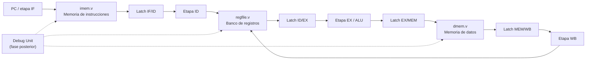

La función de cada bloque es diferente:

| Módulo | Función principal | Etapa donde participa |
|---|---|---|
| `regfile.v` | Guardar los 32 registros arquitectónicos | ID y WB |
| `imem.v` | Guardar el programa y entregar la instrucción indicada por el PC | IF |
| `dmem.v` | Leer y escribir datos de `load` / `store` | MEM |

---

# 2. `regfile.v` — Banco de registros

## 2.1. Objetivo

El banco de registros representa los **32 registros arquitectónicos** de RISC‑V:

```text
x0, x1, x2, ... x31
```

Cada registro tiene 32 bits:

```verilog
reg [31:0] r_regs [0:31];
```

Por lo tanto, conceptualmente el módulo contiene:

```text
32 registros × 32 bits
```

La implementación posee:

- dos puertos de lectura para `rs1` y `rs2`;
- un puerto de escritura para `rd`;
- un puerto adicional de lectura para debug.

Esto coincide con lo que necesitará la etapa ID del pipeline: una instrucción puede leer simultáneamente dos registros fuente.

---

## 2.2. Interfaz del módulo

```verilog
module regfile (
    input  wire        i_clk,
    input  wire        i_rst,
    input  wire        i_write_en,
    input  wire [4:0]  i_write_addr,
    input  wire [31:0] i_write_data,
    input  wire [4:0]  i_read_addr_a,
    input  wire [4:0]  i_read_addr_b,
    input  wire [4:0]  i_dbg_addr,
    output wire [31:0] o_read_data_a,
    output wire [31:0] o_read_data_b,
    output wire [31:0] o_dbg_data
);
```

Los puertos pueden interpretarse así:

| Puerto | Función |
|---|---|
| `i_clk` | Clock del sistema |
| `i_rst` | Reset síncrono del banco |
| `i_write_en` | Habilita escritura |
| `i_write_addr` | Registro destino `rd` |
| `i_write_data` | Valor que se escribirá |
| `i_read_addr_a` | Dirección de `rs1` |
| `i_read_addr_b` | Dirección de `rs2` |
| `i_dbg_addr` | Registro solicitado por Debug Unit |
| `o_read_data_a` | Valor de `rs1` |
| `o_read_data_b` | Valor de `rs2` |
| `o_dbg_data` | Valor leído por debug |

---

## 2.3. Diagrama interno

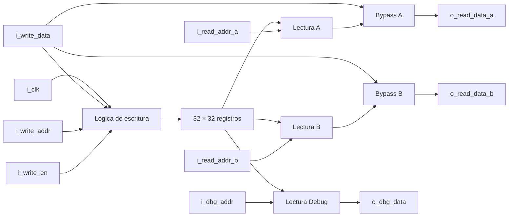

---

## 2.4. Escritura síncrona

La escritura ocurre únicamente en el flanco positivo:

```verilog
always @(posedge i_clk) begin
    if (i_rst) begin
        for (r_index = 0; r_index < 32; r_index = r_index + 1)
            r_regs[r_index] <= 32'd0;
    end else if (i_write_en && i_write_addr != 5'd0) begin
        r_regs[i_write_addr] <= i_write_data;
    end
end
```

Esto significa que el banco **conserva su contenido entre ciclos**.

En el pipeline futuro, la escritura vendrá desde la etapa WB:

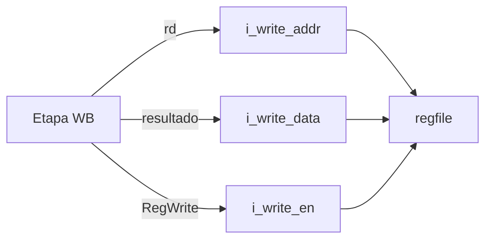

---

## 2.5. Tratamiento especial de `x0`

En RISC‑V:

```text
x0 = 0
```

siempre.

Por eso el módulo impide escribir sobre la dirección cero:

```verilog
else if (i_write_en && i_write_addr != 5'd0)
```

Además, en lectura se fuerza explícitamente a cero:

```verilog
(i_read_addr_a == 5'd0) ? 32'd0 : ...
```

y:

```verilog
(i_read_addr_b == 5'd0) ? 32'd0 : ...
```

Esto es una implementación robusta porque protege la semántica arquitectónica de `x0` tanto en lectura como en escritura.

---

## 2.6. Lectura combinacional

Los dos puertos de lectura son combinacionales:

```verilog
assign o_read_data_a = ...
assign o_read_data_b = ...
```

Por lo tanto, al cambiar:

```text
i_read_addr_a
```

la salida:

```text
o_read_data_a
```

cambia sin esperar un nuevo flanco de clock.

Esto es conveniente en ID:

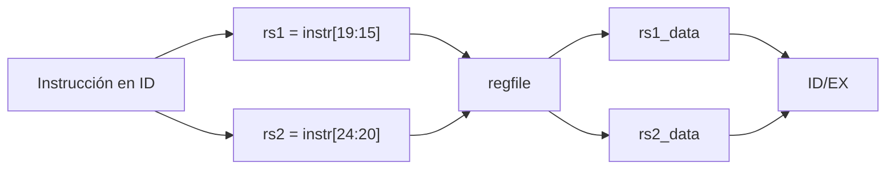

---

## 2.7. Bypass interno de WB hacia ID

Una característica importante del diseño es:

```verilog
(i_write_en &&
 !i_rst &&
 i_write_addr != 5'd0 &&
 i_write_addr == i_read_addr_a)
    ? i_write_data
    : r_regs[i_read_addr_a];
```

La misma lógica existe para el puerto B.

Esto resuelve el caso:

```text
WB quiere escribir x5
ID quiere leer x5
```

durante el mismo ciclo.

Sin bypass, la lectura podría observar el valor viejo dependiendo de cómo se implemente físicamente el banco.

Con bypass:

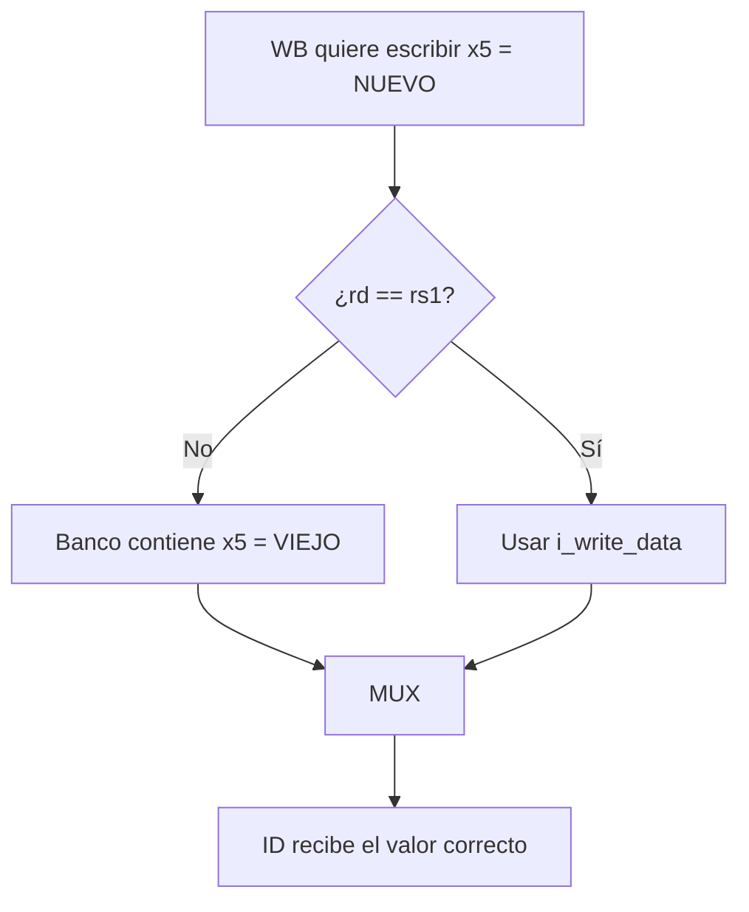

Esto permite evitar una técnica poco recomendable para FPGA: escribir el banco en `negedge`.

---

## 2.8. Puerto de debug

```verilog
assign o_dbg_data =
    (i_dbg_addr == 5'd0) ? 32'd0 :
                           r_regs[i_dbg_addr];
```

Este puerto será usado por la Debug Unit para recorrer:

```text
x0 → x1 → x2 → ... → x31
```

sin interferir con los dos puertos que utiliza normalmente el CPU.

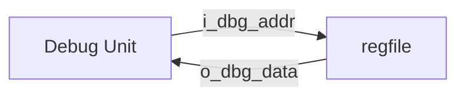

---

## 2.9. ¿Por qué esta implementación es apropiada?

Tiene varias ventajas:

1. Respeta directamente la arquitectura de RISC‑V.
2. Permite dos lecturas simultáneas.
3. Implementa `x0` de forma segura.
4. La escritura es síncrona y usa `posedge`.
5. El bypass simplifica la futura resolución de dependencias entre WB e ID.
6. El puerto debug prepara el módulo para la interfaz solicitada por la consigna.
7. El tamaño 32 × 32 es suficientemente pequeño para una implementación directa en FPGA.

El testbench asociado verifica:

- reset;
- escritura y lectura;
- bypass;
- protección de `x0`;
- lectura de debug.

---

# 3. `dmem.v` — Memoria de datos

## 3.1. Objetivo

`dmem.v` implementa la memoria utilizada por las instrucciones:

```text
Load:
lb
lh
lw
lbu
lhu

Store:
sb
sh
sw
```

La memoria debe permitir trabajar con:

- bytes;
- halfwords;
- words;
- extensión de signo;
- extensión con ceros;
- accesos de debug.

---

## 3.2. Organización física en cuatro carriles de bytes

La memoria no está declarada como:

```verilog
reg [31:0] mem [0:WORDS-1];
```

sino como cuatro memorias de 8 bits:

```verilog
reg [7:0] r_mem0 [0:WORDS-1];
reg [7:0] r_mem1 [0:WORDS-1];
reg [7:0] r_mem2 [0:WORDS-1];
reg [7:0] r_mem3 [0:WORDS-1];
```

Cada palabra de 32 bits se construye así:

```text
r_mem3 | r_mem2 | r_mem1 | r_mem0
  31:24   23:16    15:8     7:0
```

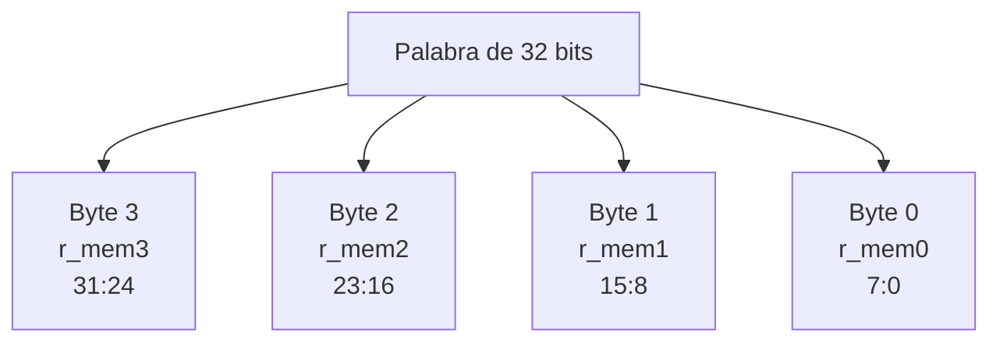

Esta organización es especialmente conveniente para `sb` y `sh`, porque permite escribir solo determinados carriles.

---

## 3.3. Dirección por bytes y dirección por palabras

El CPU entrega una dirección de byte:

```verilog
i_cpu_addr
```

Para elegir una palabra se descartan los dos bits inferiores:

```verilog
i_cpu_addr[31:2]
```

porque:

```text
1 word = 4 bytes
```

Los bits:

```text
addr[1:0]
```

indican el byte dentro de la palabra.

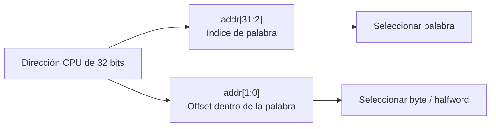

---

## 3.4. Decodificación de `funct3`

El módulo utiliza:

```verilog
i_cpu_funct3
```

para saber qué acceso se está solicitando.

En lectura:

| `funct3` | Operación | Tamaño |
|---|---|---|
| `000` | `lb` | byte |
| `001` | `lh` | halfword |
| `010` | `lw` | word |
| `100` | `lbu` | byte |
| `101` | `lhu` | halfword |

En escritura:

| `funct3` | Operación |
|---|---|
| `000` | `sb` |
| `001` | `sh` |
| `010` | `sw` |

El bloque:

```verilog
always @(*) begin
    r_size = 2'd0;
    r_type_valid = 1'b0;
    ...
end
```

traduce `funct3` a una representación interna de tamaño:

```text
0 → byte
1 → halfword
2 → word
```

---

## 3.5. Comprobación de alineación

El diseño rechaza accesos desalineados:

```verilog
wire w_aligned =
    (r_size == 2'd0) ||
    (r_size == 2'd1 && i_cpu_addr[0] == 1'b0) ||
    (r_size == 2'd2 && i_cpu_addr[1:0] == 2'b00);
```

Eso implica:

### Byte

Puede comenzar en cualquier posición:

```text
offset 0, 1, 2 o 3
```

### Halfword

Debe comenzar en:

```text
offset 0 o 2
```

### Word

Debe comenzar en:

```text
offset 0
```

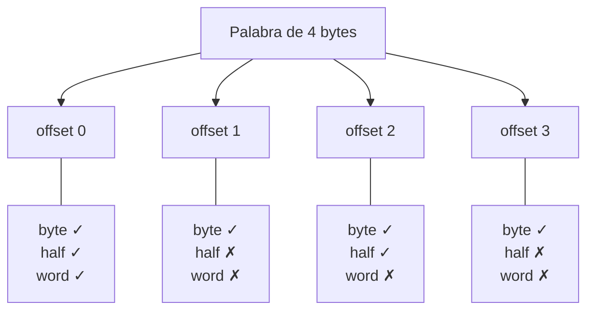

Esta política es razonable y, además, hace explícita una decisión arquitectónica que conviene documentar.

---

## 3.6. Validación de acceso

El acceso solo se acepta si:

```verilog
w_cpu_valid =
    (i_cpu_read_en ^ i_cpu_write_en) &&
    r_type_valid &&
    w_cpu_range &&
    w_aligned &&
    !i_dbg_write_en;
```

Eso verifica varias cosas a la vez:

- exactamente una operación: lectura **o** escritura;
- `funct3` válido;
- dirección dentro del rango;
- dirección correctamente alineada;
- no hay escritura debug simultánea.

Si alguna condición falla:

```verilog
o_cpu_error = 1
```

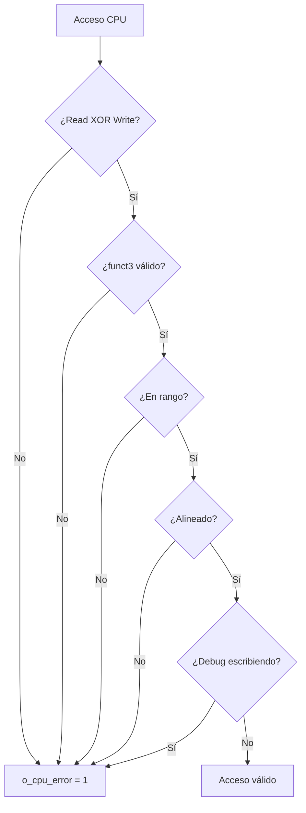

---

## 3.7. Stores: selección por byte

Para un store se calcula:

```verilog
wire [31:0] w_store_data =
    i_cpu_write_data << (i_cpu_addr[1:0] * 8);
```

Luego se genera:

```verilog
r_byte_en
```

### `sb`

```verilog
4'b0001 << i_cpu_addr[1:0]
```

Ejemplos:

```text
addr offset 0 → 0001
addr offset 1 → 0010
addr offset 2 → 0100
addr offset 3 → 1000
```

### `sh`

```verilog
4'b0011 << i_cpu_addr[1:0]
```

Con alineación válida:

```text
offset 0 → 0011
offset 2 → 1100
```

### `sw`

```text
1111
```

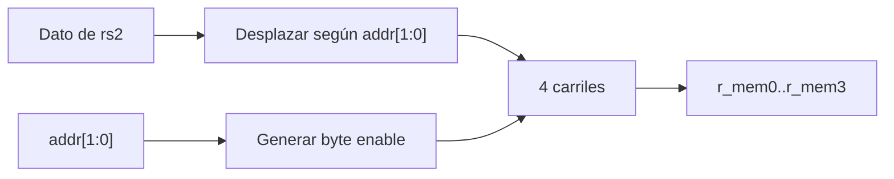

---

## 3.8. Loads y extensión

Primero se reconstruye la palabra completa:

```verilog
{r_mem3, r_mem2, r_mem1, r_mem0}
```

Después se selecciona el byte o halfword correspondiente.

### `lb`

```verilog
{{24{w_byte_data[7]}}, w_byte_data}
```

Extiende el signo.

Ejemplo:

```text
0x80 → 0xFFFFFF80
```

### `lbu`

```verilog
{24'd0, w_byte_data}
```

Extiende con ceros.

```text
0x80 → 0x00000080
```

### `lh`

Extensión de signo de 16 a 32 bits.

### `lhu`

Extensión con ceros.

### `lw`

Entrega directamente los 32 bits.

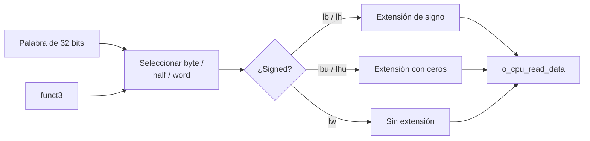

---

## 3.9. `touched` y `dirty`

El módulo contiene:

```verilog
reg [WORDS-1:0] r_touched;
reg [WORDS-1:0] r_dirty;
```

### `touched`

Se activa cuando el CPU realizó un acceso válido:

```verilog
r_touched[w_cpu_index] <= 1'b1;
```

### `dirty`

Se activa solamente cuando el CPU escribió:

```verilog
r_dirty[w_cpu_index] <= 1'b1;
```

Interpretación:

| Estado | Significado |
|---|---|
| `touched = 0` | el CPU no utilizó esa palabra |
| `touched = 1` | el CPU la leyó o escribió |
| `dirty = 1` | el CPU la modificó |

Esto es útil para la futura Debug Unit, porque permite identificar la **memoria realmente utilizada** sin transmitir necesariamente toda la RAM.

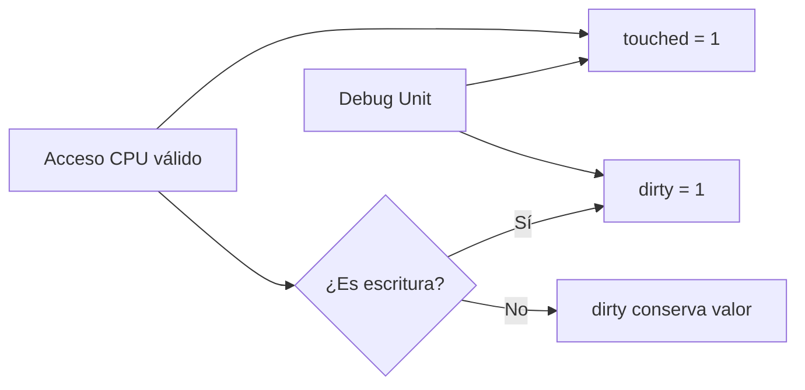

Las banderas se limpian en:

```text
reset
o
inicio de una nueva ejecución (`i_run_start`)
```

sin borrar los datos almacenados en RAM.

---

## 3.10. Puerto de debug

Debug puede:

- leer una palabra;
- escribir una palabra completa;
- consultar `touched`;
- consultar `dirty`;
- detectar dirección inválida.

La escritura debug tiene prioridad sobre la escritura CPU:

```verilog
if (i_dbg_write_en && !o_dbg_error)
    ...
else if (r_byte_en[...])
    ...
```

Además, un acceso CPU se considera inválido mientras Debug está escribiendo.

Esto evita que ambos maestros modifiquen simultáneamente la memoria.

---

## 3.11. Integración futura en MEM

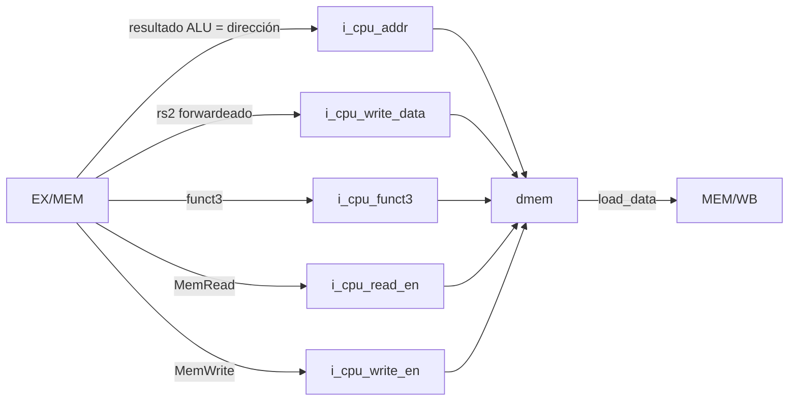

---

## 3.12. ¿Por qué esta implementación es apropiada?

Puntos fuertes:

1. Soporta todos los tamaños de acceso solicitados.
2. Los cuatro byte lanes simplifican `sb` y `sh`.
3. Maneja correctamente `lb`/`lh` frente a `lbu`/`lhu`.
4. Rechaza accesos inválidos y desalineados.
5. Evita conflicto simultáneo CPU/debug.
6. Tiene soporte explícito para la futura interfaz de debug.
7. `touched`/`dirty` ayudan a reportar únicamente la memoria usada.
8. La lectura CPU es combinacional, lo que mantiene un datapath sencillo para las primeras versiones del pipeline.

### Punto a revisar

Las escrituras físicas de RAM no están explícitamente bloqueadas por `i_rst`.

Este tema se desarrolla al final del documento y también se recomienda revisarlo antes de integrar el CPU.

---

# 4. `imem.v` — Memoria de instrucciones

## 4.1. Objetivo

`imem.v` guarda las instrucciones que el procesador ejecutará.

Su función principal en IF será:

```text
PC → memoria de instrucciones → instrucción
```

Sin embargo, esta implementación incorpora también una interfaz de **carga dinámica de programa**, lo cual prepara el módulo para la futura Debug Unit y UART.

---

## 4.2. Memoria interna

```verilog
reg [31:0] r_mem [0:WORDS-1];
```

Cada entrada contiene una instrucción completa de 32 bits.

Con:

```text
WORDS = 256
```

la capacidad es:

```text
256 × 4 bytes = 1024 bytes
```

de instrucciones.

---

## 4.3. Camino de fetch

El CPU entrega:

```verilog
i_fetch_addr
```

Normalmente será el PC.

Los bits inferiores deben ser:

```text
00
```

porque las instrucciones de este diseño tienen 4 bytes.

```verilog
i_fetch_addr[1:0] == 2'b00
```

Los bits superiores seleccionan la palabra:

```verilog
i_fetch_addr[INDEX_WIDTH+1:2]
```

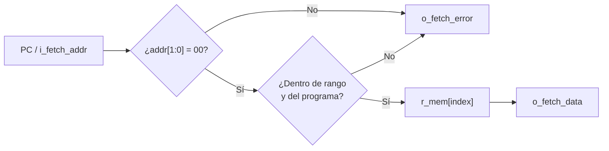

---

## 4.4. `o_program_valid`

El CPU no puede leer instrucciones hasta que haya un programa confirmado:

```verilog
assign o_fetch_error =
    !o_program_valid ||
    ...
```

Esto evita ejecutar:

- basura;
- datos viejos;
- un programa cargado parcialmente.

---

# 4.5. Protocolo de carga: `start → write → commit`

Esta implementación define una pequeña transacción de programación.

## Paso 1 — `i_load_start`

```text
Comienza una nueva carga.
```

Efectos:

- `r_loading = 1`;
- `o_program_valid = 0`;
- `o_load_error = 0`;
- `o_program_words = 0`.

No es necesario borrar físicamente toda la RAM.

---

## Paso 2 — `i_load_write`

Cada palabra debe escribirse en orden:

```text
0
4
8
12
...
```

El diseño exige:

```verilog
w_load_word_addr == o_program_words
```

Eso significa que no permite “saltar” posiciones durante la carga.

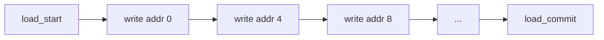

---

## Paso 3 — `i_load_commit`

`commit` indica:

```text
La carga terminó; este programa puede considerarse válido.
```

Solo se marca:

```verilog
o_program_valid = 1
```

si:

- realmente había una carga activa;
- no hubo errores;
- no se intenta escribir y hacer commit simultáneamente;
- se cargó al menos una palabra.

---

## 4.6. Contador `o_program_words`

```verilog
o_program_words
```

indica cuántas instrucciones se cargaron.

Esto cumple dos funciones:

1. determinar cuál es la próxima dirección esperada durante la carga;
2. impedir que IF lea más allá del programa actual.

La condición:

```verilog
w_fetch_word_addr < o_program_words
```

evita ejecutar contenido antiguo que haya quedado almacenado después de cargar un programa más corto.

### Ejemplo

Primero se carga:

```text
Programa A:
word 0
word 1
word 2
word 3
```

Luego se carga:

```text
Programa B:
word 0
word 1
```

Las posiciones 2 y 3 pueden seguir conteniendo físicamente restos de A.

Pero:

```text
o_program_words = 2
```

por lo que esas posiciones quedan inaccesibles para fetch.

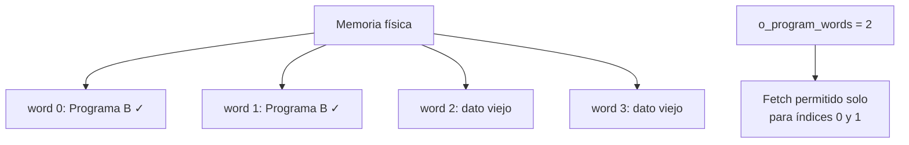

Esta es una buena forma de permitir reprogramación sin tener que vaciar toda la memoria.

---

## 4.7. Errores de carga detectados

La lógica rechaza:

- escritura sin una carga activa;
- dirección desalineada;
- dirección fuera de rango;
- escritura en una dirección distinta a la siguiente esperada;
- `write` y `commit` simultáneos;
- commit sin haber cargado instrucciones;
- commit sin `load_start` previo.

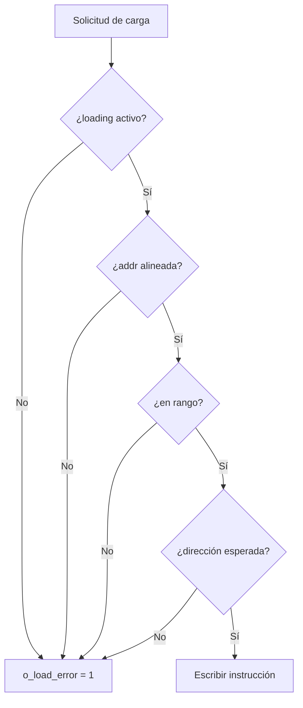

---

## 4.8. Integración futura con IF y Debug Unit

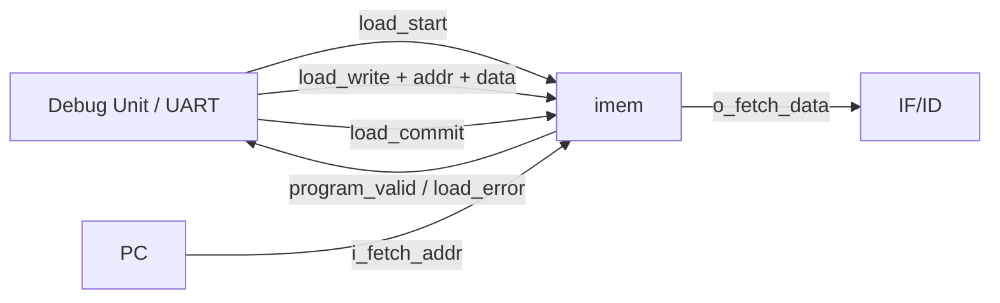

El CPU utiliza el puerto de fetch.

La Debug Unit utilizará la interfaz de carga.

Esto separa correctamente:

```text
ejecución
```

de:

```text
programación
```

---

## 4.9. ¿Por qué esta implementación es apropiada?

1. Permite reprogramar el procesador sin resíntesis.
2. Evita ejecutar un programa parcialmente cargado.
3. Detecta accesos desalineados.
4. Detecta programas demasiado grandes.
5. Exige una carga secuencial fácil de implementar por UART.
6. `o_program_words` evita tener que borrar físicamente la RAM entre programas.
7. La lectura de fetch es combinacional y compatible con un pipeline sencillo.
8. La interfaz `start/write/commit` establece un contrato claro entre memoria y Debug Unit.

Esta implementación va más allá del mínimo de la Fase 2, pero prepara directamente requisitos posteriores del trabajo final.

---

# 5. Cómo trabajan juntos los tres bloques

Los tres módulos almacenan tipos diferentes de estado:

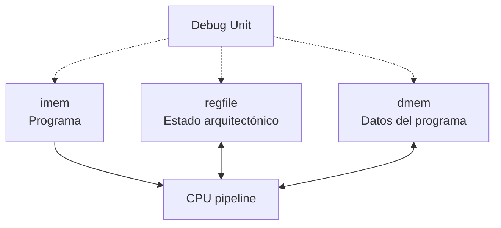

Puede pensarse así:

| Estado | Módulo |
|---|---|
| Qué instrucciones ejecutar | `imem` |
| Valores de `x0..x31` | `regfile` |
| Variables y datos almacenados | `dmem` |

Durante una ejecución típica:

```mermaid
sequenceDiagram
    participant IF as IF
    participant IM as imem
    participant ID as ID
    participant RF as regfile
    participant EX as EX
    participant DM as dmem
    participant WB as WB

    IF->>IM: PC
    IM-->>IF: instrucción
    ID->>RF: rs1, rs2
    RF-->>ID: operandos
    ID->>EX: datos + control
    EX->>DM: dirección / store_data
    DM-->>WB: load_data
    WB->>RF: rd + resultado
```

---

# 6. Relación con las instrucciones

## Operación R / I-ALU

```text
regfile → ALU → regfile
```

`dmem` no participa.

## Load

```text
regfile(rs1)
    ↓
ALU calcula dirección
    ↓
dmem lee
    ↓
regfile(rd)
```

```mermaid
flowchart LR
    RF["regfile\nrs1"] --> ALU["ALU\nrs1 + imm"]
    ALU --> DM["dmem\nload"]
    DM --> RF2["regfile\nrd"]
```

## Store

```text
regfile(rs1, rs2)
    ↓
ALU calcula dirección
    ↓
dmem escribe rs2
```

```mermaid
flowchart LR
    RF1["regfile\nrs1"] --> ALU["ALU\nrs1 + imm"]
    RF2["regfile\nrs2"] --> DM["dmem"]
    ALU --> DM
```

## Fetch de cualquier instrucción

```text
PC → imem → instruction
```

---

# 7. Punto de revisión recomendado: escrituras en `dmem` durante reset

La memoria de datos tiene cuatro bloques como este:

```verilog
always @(posedge i_clk) begin
    if (i_dbg_write_en && !o_dbg_error)
        r_mem0[w_dbg_index] <= i_dbg_write_data[7:0];
    else if (r_byte_en[0])
        r_mem0[w_cpu_index] <= w_store_data[7:0];
end
```

Obsérvese que **no aparece `i_rst`** en la condición de escritura.

Por otro lado:

```verilog
w_cpu_valid
```

tampoco incluye:

```verilog
!i_rst
```

Por lo tanto, en teoría puede ocurrir:

```text
i_rst = 1
i_cpu_write_en = 1
dirección válida
funct3 válido
```

y, al producirse el flanco positivo:

```text
la RAM puede escribirse
```

al mismo tiempo que:

```text
r_touched = 0
r_dirty = 0
```

porque esas dos estructuras sí se reinician con `i_rst`.

Esto puede crear un estado inconsistente:

```text
la memoria cambió
pero las banderas dicen que no fue usada/modificada
```

El problema no significa que la RAM deba borrarse durante reset.

Son dos conceptos distintos:

```text
1. Borrar todo el contenido de dmem con reset
2. Impedir nuevas escrituras mientras reset está activo
```

La segunda medida suele ser la importante.

Una posible corrección consiste en bloquear la escritura CPU durante reset:

```verilog
wire w_cpu_valid =
    !i_rst &&
    (i_cpu_read_en ^ i_cpu_write_en) &&
    r_type_valid &&
    w_cpu_range &&
    w_aligned &&
    !i_dbg_write_en;
```

o hacerlo directamente en los bloques secuenciales:

```verilog
always @(posedge i_clk) begin
    if (!i_rst) begin
        if (i_dbg_write_en && !o_dbg_error)
            ...
        else if (r_byte_en[0])
            ...
    end
end
```

La política del puerto debug durante reset debe decidirse explícitamente.

Si se desea permitir que Debug inicialice memoria mientras el CPU está detenido, eso no implica necesariamente que deba permitirse durante `i_rst`.

También es conveniente establecer como contrato que:

```text
cuando i_run_start = 1
el CPU todavía no debe generar un store
```

porque `i_run_start` limpia `touched` y `dirty`; una escritura en ese mismo flanco podría modificar RAM mientras las banderas quedan reiniciadas.

---

# 8. Evaluación global

## `regfile.v`

**Estado conceptual:** sólido.

Implementa exactamente los elementos importantes para la Fase 2:

- 32 × 32;
- `x0`;
- dos lecturas;
- una escritura;
- bypass;
- debug.

## `dmem.v`

**Estado conceptual:** completo y bien pensado.

Tiene más funcionalidad que una RAM mínima:

- byte lanes;
- chequeos;
- signed/unsigned loads;
- debug;
- `touched`;
- `dirty`.

La principal recomendación previa a la integración es definir explícitamente la política de escritura durante `reset` y `run_start`.

## `imem.v`

**Estado conceptual:** robusto y orientado a la integración futura.

La máquina de carga:

```text
start → write(s) → commit
```

es una base clara para la futura carga por UART y permite evitar el borrado físico completo de la memoria al reprogramar.

---

# 9. Criterios de verificación cubiertos por los testbenches actuales

Los testbenches incluidos en el snapshot prueban, entre otras cosas:

### `tb_regfile.sv`

- reset;
- escritura;
- lectura;
- bypass antes del flanco;
- `x0`;
- debug.

### `tb_dmem.sv`

- `sb` en los cuatro offsets;
- `lb` / `lbu`;
- `sh`;
- `lh` / `lhu`;
- `sw` / `lw`;
- accesos desalineados;
- fuera de rango;
- `funct3` inválido;
- `touched`;
- `dirty`;
- prioridad de debug frente al CPU.

### `tb_imem.sv`

- fetch antes de cargar programa;
- carga normal;
- commit;
- reprogramación;
- acceso fuera del programa;
- dirección desalineada;
- salto de posiciones durante carga;
- programa vacío;
- programa demasiado grande;
- `write` y `commit` simultáneos.

---

# 10. Fuentes

- Snapshot del proyecto suministrado para la Fase 2:
  - `rtl/regfile.v`
  - `rtl/dmem.v`
  - `rtl/imem.v`
  - sus testbenches asociados.
- *Hoja de ruta del pipeline RISC‑V* — Fase 2, “Banco de registros y memorias”.
- Patterson & Hennessy, *Computer Organization and Design: The Hardware/Software Interface — RISC‑V Edition*, capítulos de datapath, banco de registros, memoria y pipeline.
