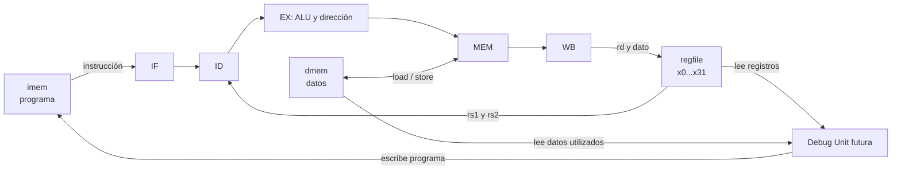

# Fase 2: banco de registros y memorias

> **Estado:** informe de diseño para estudiar y discutir. La fase 2 **todavía no está implementada**. Las interfaces y políticas marcadas como propuestas podrán cambiar antes de escribir el RTL.

## 1. Punto de partida y objetivo

El procesador proyectado tiene cinco etapas: IF busca una instrucción, ID la decodifica y lee registros, EX calcula, MEM accede a datos y WB escribe el resultado. La fase 1 ya creó `alu.v`, `alu_control.v`, `imm_gen.v` y `control.v`; estos módulos calculan y decodifican, pero no almacenan el estado arquitectónico de un programa. La fase 2 incorpora los tres almacenes que faltan:

| Bloque | Qué guarda | Quién lo usa durante la ejecución | Otro acceso necesario |
|---|---|---|---|
| Banco de registros (`regfile`) | Los 32 registros de 32 bits `x0` a `x31`. | ID lee `rs1` y `rs2`; WB escribe `rd`. | La Debug Unit lee los 32 registros. |
| Memoria de instrucciones (`imem`) | Palabras de 32 bits que forman el programa. | IF lee la instrucción del PC. | La Debug Unit escribe el programa recibido por UART. |
| Memoria de datos (`dmem`) | Bytes de datos agrupados en palabras de 32 bits. | MEM ejecuta `lb`, `lh`, `lw`, `lbu`, `lhu`, `sb`, `sh` y `sw`. | La Debug Unit lee los datos para el dump y podría borrarlos al reprogramar. |

La consigna exige cargar y **reprogramar por UART sin resintetizar**, mostrar los 32 registros, los latches y la memoria de datos utilizada, y ofrecer ejecución continua y paso a paso. También exige que el pipeline esté vacío al terminar. La [hoja de ruta](../../Hoja%20de%20ruta%20del%20pipeline%20RISC-V.html) sitúa estos bloques en la fase 2; el [PDF de la consigna](../../TRABAJO%20FINAL%202026.pdf) fija los requisitos del sistema. El diseño general y el papel de cada etapa están en [00_datapath.md](00_datapath.md); la fase combinacional está en [01_combinacionales.md](01_combinacionales.md).

El resultado buscado para esta fase es poder probar cada almacén por separado, con sus reglas de lectura, escritura y depuración bien definidas. Conectar el CPU completo, los latches, la UART y la máquina de estados de la Debug Unit pertenece a fases posteriores. Diseñar ahora los puertos evita que la integración obligue a rehacer las memorias.



El dibujo muestra conexiones lógicas, no significa que todos los accesos sucedan en un mismo flanco. `imem` y `dmem` tendrán lectura asíncrona en el modelo pequeño acordado para el datapath; sus escrituras ocurrirán en el flanco de subida. El banco tendrá lecturas combinacionales y escritura en ese mismo tipo de flanco. Todos comparten el clock del sistema: el paso a paso se realiza habilitando el avance del CPU durante un ciclo, sin modificar el clock.

## 2. Contrato de avance del CPU

Conviene distinguir **clock**, **habilitación** y **validez**:

- El clock sigue llegando normalmente a todos los bloques.
- `cpu_en` permite que el procesador avance un ciclo; puede valer cero mientras se inspecciona el estado.
- El bit `valid` de un latch indica si allí hay una instrucción real o una burbuja.
- Una escritura de WB ocurre únicamente si avanzó una instrucción válida con `reg_write`, destino distinto de `x0` y ausencia de condición de error que impida el efecto.
- Un store ocurre únicamente si avanzó una instrucción válida con `mem_write` y la dirección/tamaño son aceptados.

La condición de escritura se formará en la integración, aproximadamente como `adv && valid && reg_write` o `adv && valid && mem_write`. El módulo de memoria recibirá una habilitación de escritura ya coherente con el pipeline; no debe interpretar por sí solo una burbuja como una operación real. El reset del CPU debe tener prioridad frente a `cpu_en`, para poder abortar o iniciar otra ejecución estando detenido.

Una **lectura asíncrona** significa que, una vez estable la dirección, el dato aparece tras el retardo combinacional, dentro del mismo ciclo. **No significa memoria sin clock:** la escritura sigue siendo sincrónica. Este modelo permite que IF e ID, y MEM y WB, se comporten según el datapath de cinco etapas acordado. En una migración futura a Block RAM habría que revisar el pipeline porque la lectura de esa RAM suele ser sincrónica. [Referencia de AMD sobre RAM distribuida y Block RAM](https://docs.amd.com/r/2025.2-English/ug901-vivado-synthesis/Choosing-Between-Distributed-RAM-and-Dedicated-Block-RAM).

## 3. Banco de registros: `regfile`

### 3.1 Estructura y puertos propuestos

Son 32 posiciones de 32 bits. Las instrucciones identifican registros con cinco bits: `rs1 = instr[19:15]`, `rs2 = instr[24:20]` y `rd = instr[11:7]`. Se requieren dos puertos de lectura simultánea para ID, un puerto de escritura desde WB y una lectura adicional para depuración:

| Grupo | Señales conceptuales | Uso |
|---|---|---|
| Clock y reset | `i_clk`, `i_rst` | Escritura sincrónica y comienzo limpio de una ejecución. |
| Lecturas de CPU | `i_rs1_addr`, `i_rs2_addr`, `o_rs1_data`, `o_rs2_data` | ID obtiene los operandos a la vez. |
| Escritura de CPU | `i_wr_en`, `i_wr_addr`, `i_wr_data` | WB entrega el resultado de una instrucción válida. |
| Lectura debug | `i_dbg_addr`, `o_dbg_data` | Permite recorrer `x0` a `x31` para el dump. |

Los nombres son una **propuesta de interfaz**, no puertos existentes. Se seguirá el estilo del TP1 y TP2: nombres en inglés con prefijos `i_`, `o_`, `w_` y `r_`, y comentarios en RTL solo cuando aclaren una excepción importante.

### 3.2 Regla de `x0`

En RISC-V, leer `x0` siempre devuelve cero y escribirlo no cambia su valor. Por ejemplo, `addi x0,x1,5` debe ejecutarse sin modificar ningún registro visible. La implementación puede ignorar toda escritura a índice cero y forzar a cero tanto las lecturas de CPU como la lectura debug de `x0`. Una celda física `regs[0]` puede existir por comodidad, pero no debemos depender de su contenido para producir el valor arquitectónico.

### 3.3 Lectura y escritura del mismo registro: bypass local

Supongamos que WB va a escribir `x5 = 9` mientras ID lee `x5` en el mismo ciclo. La salida de lectura debe presentar `9`. Se agrega un mux combinacional por puerto: si la escritura está habilitada, `rd != 0` y la dirección leída coincide con `rd`, se entrega el dato nuevo; en los demás casos se lee el arreglo. `x0` tiene prioridad y siempre devuelve cero.

Este **bypass local del banco** resuelve la coincidencia entre **WB e ID**. No resuelve por sí solo dependencias con resultados aún en EX o MEM; para ellas habrá forwarding y, cuando corresponda, stalls en fases posteriores. No hace falta escribir en el flanco de bajada. La escritura normal ocurre en `posedge` y el mux selecciona el dato correcto durante el ciclo.

### 3.4 Reset y lectura de depuración

La propuesta de ejecución limpia es poner a cero los registros generales al iniciar un programa nuevo. La salida debug debe mostrar el estado arquitectónico confirmado. Mientras el CPU está detenido no hay escrituras de WB; la Debug Unit puede seleccionar una dirección y leer el registro. Si se inspecciona durante un ciclo activo en que WB escribe esa misma dirección, hay que documentar si debug muestra el valor previo o el nuevo. La propuesta más simple para el modo paso a paso es transmitir la instantánea **después del flanco del paso**, cuando el resultado ya fue escrito.

El reset de los registros es un requisito de política de reprogramación por cerrar al final de este informe; se incluye en la propuesta recomendada. En síntesis, este banco pequeño con dos lecturas simultáneas y reset explícito probablemente ocupará registros y muxes, algo que se confirmará con Vivado; no hay que dar por sentado que se inferirá como una única Block RAM.

## 4. Memoria de instrucciones: `imem`

### 4.1 Organización y acceso

La propuesta inicial es una memoria pequeña de **256 palabras de 32 bits**: 1024 bytes de programa, con direcciones de byte `0` a `1023`. Es un tamaño para empezar y debe quedar confirmado antes del RTL. El PC y los destinos de salto son direcciones de **byte**; como las instrucciones admitidas tienen 32 bits y no se implementa la extensión comprimida, una instrucción válida comienza en una dirección múltiplo de cuatro. El índice del arreglo es `PC >> 2`: PC `0` selecciona la palabra 0, PC `4` la palabra 1.

Durante la ejecución, IF lee una instrucción combinacionalmente. Durante la programación, la Debug Unit escribe una palabra completa por flanco. Ambos accesos pertenecen a la misma memoria física; la política de operación debe impedir que el CPU ejecute mientras se está cargando un programa. Así se evita depender de qué valor vería una lectura y escritura simultáneas en la misma dirección.

| Puerto lógico | Señales conceptuales | Regla |
|---|---|---|
| Fetch | dirección de PC, instrucción | Lectura asíncrona solo de un índice válido y cargado. |
| Carga | índice o dirección, palabra, `write_enable` | Escritura sincrónica con CPU detenido. |
| Control | longitud del programa, `program_valid` | Evita arrancar una carga incompleta o acceder a instrucciones sobrantes. |

La memoria no necesita limpiarse físicamente si un registro de **longitud del programa cargado** delimita la zona ejecutable. Para `N` palabras, son válidas las direcciones de instrucción `0, 4, ..., 4(N-1)`. Que el PC alcance `4N` no debe permitir ejecutar una palabra antigua que quedó en `imem[N]`. La longitud y la validez son lógica de control del sistema, aunque la comprobación puede estar junto a `imem`.

El HALT ya elegido en la fase 1 es exactamente `0x00000073` (`ECALL`). Una instrucción fuera del programa cargado no debe confundirse con un HALT válido: sería un final anormal o un error de fetch, a definir junto con el control de finalización.

### 4.2 `$readmemh` en los testbenches

`$readmemh` toma palabras hexadecimales de un archivo y las coloca en un arreglo de memoria. Un archivo de prueba sencillo podría contener:

```text
00500093
00000073
```

La primera palabra codifica `addi x1,x0,5`; la segunda es el HALT acordado. Al cargarlas en las posiciones 0 y 1, IF podrá leerlas con PC `0` y `4`. Hay que acordar que el archivo representa **una palabra de 32 bits por línea en orden de dirección creciente**; los bytes UART y el orden little-endian se tratarán explícitamente al definir el protocolo de carga. También hay que fijar la ruta del archivo de test según el directorio desde el que corre la simulación.

Se propone usar `$readmemh` en el **testbench de CPU**, antes de iniciar la ejecución, para probar el pipeline con un programa conocido. Esto reduce el tiempo de simulación y separa errores del CPU de errores de UART. Las posiciones que el archivo no carga pueden conservar valores `X` en simulación; la prueba debe conocer la longitud válida y no buscar instrucciones fuera de ella. El testbench del puerto de programación puede escribir palabras directamente mediante sus señales, y la prueba integral final deberá cargar un programa mediante los bytes UART reales.

**Aclaración sobre síntesis:** `$readmemh` también puede inicializar una memoria al sintetizar con Vivado; no es una función exclusiva del testbench. Si lo usáramos en RTL para iniciar la FPGA con un programa fijo, ese contenido inicial dependería de la configuración cargada en la FPGA. No cumpliría por sí solo la exigencia de reprogramar dinámicamente **por UART y sin resintetizar**. Por ello, el uso propuesto para validar el CPU aislado es una comodidad de prueba; la ruta funcional definitiva de carga es la Debug Unit. [Documentación de AMD sobre `$readmemh` y `$readmemb` en memorias](https://docs.amd.com/r/en-US/ug901-vivado-synthesis/Loading-Memory-Contents-With-File-I/O-Tasks).

## 5. Memoria de datos: `dmem`

### 5.1 Palabras, bytes y direcciones

Se proponen también **256 palabras de 32 bits**: 1024 bytes, direcciones de byte `0` a `1023`. Es una capacidad inicial pendiente de confirmación. Cada palabra tiene cuatro carriles de ocho bits. La dirección de byte se divide así:

```text
dirección de byte = { índice_de_palabra, desplazamiento[1:0] }
índice_de_palabra = dirección >> 2
desplazamiento 0, 1, 2 o 3 = carril dentro de la palabra
```

RISC-V usa orden **little-endian**: el byte menos significativo de una palabra está en su dirección menor. Si la palabra en la dirección 0 es `0xA1B2C3D4`, sus bytes en direcciones 0, 1, 2 y 3 son `D4`, `C3`, `B2` y `A1`, respectivamente. `imem` y `dmem` son espacios separados en este diseño; una escritura de datos no altera instrucciones.

### 5.2 Stores: `sb`, `sh`, `sw`

El store utiliza la dirección calculada en EX (`rs1 + inmediato`) y el dato proveniente de `rs2`. El dato de store debe llegar a MEM por un camino separado del resultado de ALU, porque la ALU entrega la **dirección**, no el valor que se guarda. En MEM se seleccionan carriles mediante `byte_enable[3:0]`; solo esos bytes cambian en el flanco:

| Operación | Bytes escritos | Ejemplo de máscaras dentro de una palabra |
|---|---:|---|
| `sb` | 1 | Offset 0: `0001`; offset 2: `0100`. |
| `sh` | 2 | Offset 0: `0011`; offset 2: `1100`. |
| `sw` | 4 | Offset 0: `1111`. |

El dato se desplaza o replica para alinear sus bytes con los carriles habilitados. Por ejemplo, con la palabra inicialmente en cero, `sb` de `0x80` a la dirección de byte 2 debe producir `0x00800000`; los otros tres bytes permanecen intactos. Una implementación por carriles es equivalente a escribir cada byte seleccionado. Nunca se habilitan carriles para una instrucción inválida, una burbuja o un CPU pausado.

### 5.3 Loads: `lb`, `lh`, `lw`, `lbu`, `lhu`

La lectura entrega la palabra de 32 bits del índice seleccionado; la lógica de load extrae el byte, media palabra o palabra completa según `funct3` y los bits bajos de la dirección:

| Operación | Ancho | Extensión hasta 32 bits |
|---|---:|---|
| `lb` | 8 bits | Copia el bit 7 del byte en los 24 bits altos. |
| `lbu` | 8 bits | Rellena con ceros los 24 bits altos. |
| `lh` | 16 bits | Copia el bit 15 de la media palabra en los 16 bits altos. |
| `lhu` | 16 bits | Rellena con ceros los 16 bits altos. |
| `lw` | 32 bits | Devuelve la palabra completa. |

Si `sb` escribió `0x80` y luego se lee esa dirección, `lb` produce `0xFFFFFF80` (valor con signo `-128`), mientras `lbu` produce `0x00000080` (valor sin signo `128`). Es una prueba fundamental para los cuatro offsets de byte. El resultado de un load llega al banco de registros a través de WB; aún no existe la conexión del pipeline para hacerlo.

### 5.4 Accesos desalineados y fuera de rango

La política de estudio aceptada es **no soportar accesos desalineados**: `lh`/`lhu`/`sh` requieren dirección par; `lw`/`sw`, múltiplo de cuatro. `lb`/`lbu`/`sb` admiten cualquier dirección de byte válida. Un acceso desalineado no debe transformarse silenciosamente en otro acceso mediante truncamiento de los bits bajos. La interfaz de memoria debe poder señalar que no fue aceptado y no debe modificar `dmem`; el tratamiento final de ese error por el CPU y la Debug Unit se definirá en la integración.

Tampoco debe haber **wraparound** para direcciones fuera de los 1024 bytes propuestos. Usar solamente los bits bajos como índice haría, por ejemplo, que una dirección superior se reinterpretara como una dirección válida y corrompiera otra posición. La comprobación debe usar la dirección completa. Una escritura fuera de rango no tendrá efecto. Para una lectura fuera de rango se puede entregar un valor inocuo, por ejemplo cero, acompañado de una señal de error; el CPU no debe usar ese valor como un load válido. La señalización exacta del error debe fijarse antes de codificar la interfaz.

### 5.5 Puerto de depuración

La Debug Unit necesita seleccionar una palabra y conocer su contenido completo de 32 bits. Un puerto lógico de lectura adicional evita tener que reutilizar la dirección de MEM para el dump. Como el CPU estará pausado o detenido cuando se transmita el estado, ese puerto puede implementarse como lectura combinacional sin competencia con una operación del CPU. Si se adopta el borrado secuencial de datos, hará falta además una ruta de escritura desde la Debug Unit o un mux que le ceda temporalmente el puerto de escritura. Solo una fuente podrá escribir la memoria por ciclo; la prioridad y los estados de control deben quedar explícitos.

## 6. Qué significa «memoria de datos usada» en el dump

La consigna pide enviar a la PC el **contenido de la memoria de datos usada**. No define si «usada» significa leída, escrita o ambas. El dump es una instantánea enviada por UART: para cada posición incluida, la PC necesita al menos su **dirección de byte** y el **valor actual**. Sin la dirección, un listado parcial sería ambiguo. El dump no contiene instrucciones de `imem`.

Hay tres criterios posibles:

| Criterio | Qué se envía | Ventaja | Límite |
|---|---|---|---|
| Toda `dmem` | Las 256 palabras, incluso nunca accedidas. | Lógica muy simple y estado completo. | Mensaje mayor y muchos ceros irrelevantes; hay que tener definido el valor inicial. |
| Palabras `dirty` | Solo las que recibieron un store válido. | Coincide con la sugerencia de la hoja de ruta y muestra cambios. | Omite una palabra que el programa solo leyó. |
| Palabras `touched` | Las que recibieron un load **o** store válido. | Interpretación literal más amplia de «usada». | Una lectura exploratoria también aparecerá, aunque no cambie el dato. |

**Propuesta para estudiar:** un bit `touched` por palabra, puesto a uno cuando una instrucción válida del CPU realiza un load o store aceptado. Opcionalmente, otro bit `dirty` distingue las palabras escritas de las solo leídas. Las operaciones de borrado o lectura de la Debug Unit **no** deben activar `touched`, porque entonces el propio proceso de preparación o dump marcaría toda la memoria como «usada». Para 256 palabras, un mapa de un bit ocupa 256 bits (32 bytes de estado lógico). Cada bit se limpia al iniciar una ejecución nueva según la política de reprogramación elegida.

Ejemplo: el programa escribe un byte en la dirección 0 y lee una palabra en la dirección 12. Se marcan los índices de palabra `0` y `3`. El dump puede emitir `(dirección 0, palabra final)` y `(dirección 12, palabra final)`. Si se borró `dmem` antes de ejecutar, la palabra de dirección 12 puede valer cero y aun así aparecer, porque fue **leída**. Un `sb` marca la palabra de 32 bits que contiene el byte; el dump informa su valor completo final, salvo que más adelante se decida añadir marcas por byte.

El bit se registra en el flanco en que la operación de memoria se acepta. Un load usa `mem_read`, un store usa `mem_write`; ambos requieren `adv`, `valid`, alineación y rango correctos. El dump debe comenzar cuando el CPU ya está detenido y las operaciones anteriores terminaron, para no transmitir unas posiciones antes y otras después de una escritura. En ejecución paso a paso, la instantánea se toma después del flanco habilitado. Al llegar al HALT, el control futuro debe drenar el pipeline antes de declarar `halted` y realizar el dump.

El formato UART concreto sigue abierto: cantidad de entradas, codificación de dirección y valor, indicadores de error y delimitación del mensaje se acordarán junto con el protocolo entre FPGA y PC. Un posible registro lógico sería `{address, value, touched, dirty}`, aunque no hace falta transmitir `touched` si solo se envían entradas marcadas. La PC podría ordenar y mostrar las direcciones en hexadecimal.

## 7. Reprogramación: por qué el contenido anterior importa

«Reprogramar» significa recibir otro programa **durante el funcionamiento del sistema**, sin volver a sintetizarlo. Para que una ejecución nueva sea reproducible hay que considerar cuatro estados independientes:

1. **PC y pipeline:** pueden contener instrucciones del programa anterior en distintas etapas. Reiniciarlos o invalidarlos evita que esas instrucciones produzcan efectos después de comenzar la nueva carga.
2. **Banco de registros:** conserva resultados previos si no se reinicia. Un programa que espera `x1 = 0` podría leer otro valor.
3. **Memoria de datos:** conserva stores previos si no se borra. Un load puede observar datos viejos.
4. **Memoria de instrucciones:** si el nuevo programa es más corto, las palabras sobrantes siguen físicamente presentes. El PC podría llegar a ellas por secuencia o por un salto.

Además está el estado **de carga**: un corte o error en UART puede dejar solo parte del programa nuevo escrita. El CPU no debe poder ejecutar una mezcla de palabras nuevas y anteriores. «Detener el CPU» significa deshabilitar su avance y sus efectos de escritura; no detener ni modificar el clock.

### 7.1 Opciones razonables

| Política | Funcionamiento | Ventaja | Costo o riesgo |
|---|---|---|---|
| Conservar estado | Se sobrescribe `imem` y se sigue o reinicia parcialmente. | Útil para continuar una sesión deliberadamente. | Programa y datos previos pueden afectar la ejecución; difícil de razonar como modo predeterminado. |
| Resetear CPU y conservar `dmem` e `imem` sobrante | PC, pipeline y registros vuelven al inicio; las memorias no se borran. | Reprogramación rápida y hardware sencillo. | El software debe inicializar todos los datos que lea; hay riesgo de instrucciones antiguas si no se controla la longitud. |
| Borrar físicamente todo | Se ponen a cero ambas memorias antes de cada carga. | Estado intuitivo y verificable. | Un reset que borre todas las celdas en un único flanco puede complicar la inferencia de RAM; un barrido secuencial requiere tiempo y control. |
| Longitud válida en `imem` y borrado secuencial de `dmem` | No se ejecutan posiciones de programa sobrantes; los datos comienzan en cero. | Estado limpio sin requerir borrar toda `imem`. | Requiere longitud, señal de programa completo y secuenciador de borrado. |
| Bits de validez por palabra | El dato físico viejo se ignora hasta que cada celda se haya vuelto a usar. | Evita el tiempo de borrado. | Más lógica y reglas delicadas para stores parciales como `sb` y `sh`. |

Por ejemplo, una memoria con 256 palabras puede borrarse mediante **256 escrituras sucesivas**, una por flanco. Esto evita describir en RTL un reset que modifica todas las celdas a la vez; la demora es pequeña frente a la transmisión UART de un programa completo, aunque dependerá del clock y de la velocidad serial concretos. El secuenciador pertenecería a la futura Debug Unit. El módulo `dmem` de la fase 2 debe ofrecer un camino de escritura que permita ese barrido sin que el CPU esté avanzando.

### 7.2 Propuesta recomendada, aún no aprobada

1. Al recibir el comando de nueva carga, la Debug Unit detiene el avance del CPU e invalida el programa anterior. Si se interrumpe una ejecución, las instrucciones aún en vuelo se descartan mediante reset; no se promete que el programa anterior termine.
2. Reinicia PC, latches del pipeline, estado `halted` y banco de registros. El reset funciona con el clock normal y tiene prioridad sobre `cpu_en`.
3. Borra `dmem` secuencialmente y limpia el mapa de palabras `touched`/`dirty`. Las escrituras de borrado no cuentan como stores del CPU.
4. Recibe por UART `N` palabras de programa y las escribe en `imem[0]` a `imem[N-1]`, verificando tamaño, dirección y recepción completa. Mientras tanto `program_valid = 0` y el CPU no ejecuta.
5. Al aceptar la carga completa, registra `program_length = N` y `program_valid = 1`. Se arranca desde PC `0` por comando de ejecución o paso.
6. Cada fetch comprueba que el PC esté alineado, dentro de la capacidad física y dentro de las `N` palabras cargadas. Si sale del rango válido sin ejecutar el HALT, se informa una terminación anormal; no se ejecutan restos antiguos.

Esta propuesta deja abierta una mejora futura de «continuar conservando datos» como modo explícito, pero el modo predeterminado sería ejecución limpia. También requiere una regla para **HALT ausente**: un salto fuera del programa cargado puede detectarse como error, pero un bucle infinito permanece dentro del rango. Un contador límite de **ciclos de CPU habilitados** permitiría recuperar el control en ejecución continua y distinguir un timeout de un HALT normal. Ese contador debe considerar que una pausa de la UART o de la interfaz no equivale a ciclos ejecutados.

No basta con comprobar que el archivo contiene un HALT en alguna posición: un salto podría no alcanzarlo. Tampoco conviene interpretar automáticamente cualquier salida del rango como un HALT, porque ocultaría un programa incompleto. El ensamblador o software de PC puede advertir o añadir el HALT, pero la FPGA debe seguir protegida ante programas defectuosos.

### 7.3 Por qué no borrar toda la memoria con `rst`

Un `for` que asigne cero a todas las celdas de una RAM dentro de `if (rst)` describe un borrado simultáneo. Según el tipo de memoria y la FPGA, eso puede impedir inferir el recurso deseado o producir más lógica de la esperada. En cambio, un contador que escribe cero en una dirección por ciclo usa el puerto normal de escritura. La elección concreta se verificará con los reportes de síntesis de Vivado; no se debe afirmar antes de medir que toda memoria propuesta terminará en un recurso determinado. [Referencia de AMD sobre inferencia de memorias](https://docs.amd.com/r/en-US/ug901-vivado-synthesis/Memory-Inference-Capabilities).

## 8. Cómo se conectarían con la fase 1

`control.v` ya distingue las instrucciones de load y store mediante `o_mem_read`, `o_mem_write`, `o_mem_to_reg`, `o_reg_write` y `o_valid_instr`. `imm_gen.v` genera el desplazamiento de dirección; `alu.v` puede sumar `rs1 + inmediato` en EX. Los nuevos bloques encajan así:

1. IF entrega el PC a `imem`; su palabra de 32 bits pasa a IF/ID.
2. ID extrae `rs1`, `rs2` y `rd` de la instrucción, lee `regfile`, y obtiene controles e inmediato de los módulos existentes.
3. EX usa la ALU para calcular la dirección efectiva de un load/store; conserva por separado el dato de `rs2` destinado al store.
4. MEM pasa dirección, tamaño y dato de store a `dmem`; para un load selecciona y extiende los bytes leídos.
5. WB escoge el dato que corresponde y, si la instrucción válida avanzó, lo escribe en `regfile`.

Los registros intermedios IF/ID, ID/EX, EX/MEM y MEM/WB aún no están creados. Deben transportar, además de datos, controles como `funct3`, `mem_read`, `mem_write`, `reg_write`, `rd` y `valid`. Por ejemplo, `dmem` no puede decidir si el byte leído debe extenderse con signo sin recibir el `funct3` que pertenecía a esa instrucción. El bypass local del banco se combinará luego con forwarding de EX/MEM y MEM/WB; no son la misma ruta.

## 9. Verificación que corresponde a esta fase

Se propondrán testbenches independientes, sin UART, antes de integrar el CPU:

| Bloque | Casos que deben comprobarse |
|---|---|
| `regfile` | Reset, lectura de `x0`, intento de escritura a `x0`, dos lecturas simultáneas, escritura en `posedge`, bypass WB→ID y lectura debug. |
| `imem` | Escritura por el puerto debug con CPU detenido, lectura de palabras 0 y última, programa más corto que otro anterior, prohibición de fetch fuera de `program_length`, carga incompleta. |
| `dmem` | `sb` en cuatro offsets, `sh` en los dos offsets alineados, `sw`, preservación de carriles no escritos, `lb` frente a `lbu`, `lh` frente a `lhu`, alineación, límite de capacidad, lectura debug y borrado secuencial si se aprueba. |
| Uso de memoria | `touched` por load y store válidos; ningún cambio por acceso rechazado, pausa, operación debug o barrido de borrado. |

Las pruebas de funcionamiento del CPU con `$readmemh` y las pruebas integrales de reprogramación UART vendrán después. La síntesis de los módulos debe confirmar qué recursos infiere Vivado y si se respetan las lecturas asíncronas acordadas. Ninguno de estos resultados está afirmado como ya obtenido: son criterios de aceptación para cuando se implemente la fase.

## 10. Decisiones que tomar antes de implementar

1. **Capacidad exacta de `imem` y `dmem`:** confirmar o cambiar la propuesta de 256 palabras (1024 bytes) para cada una. De esto dependen los anchos de índice, contadores de borrado y límites de carga.
2. **Respuesta visible a un acceso rechazado:** ya se acordó no admitir direcciones desalineadas ni fuera de rango y no hacer wraparound. Falta fijar cómo se propaga una señal de error, qué dato presenta el puerto de lectura rechazado y si el CPU se detiene, informa un fallo o toma otra acción.
3. **Política de reprogramación:** elegir entre conservar datos, borrar físicamente ambas memorias, usar longitud válida más borrado secuencial de `dmem` (recomendación) u otra variante. Confirmar expresamente qué se reinicia en el banco de registros, PC, pipeline y mapas de uso.
4. **Carga incompleta o interrumpida:** confirmar el uso de `program_valid` y `program_length`, el momento en que un programa se considera completo, y si se permite recuperar una carga fallida o se exige comenzar otra desde cero.
5. **Fin anormal:** decidir cómo se informa un PC fuera del programa cargado sin HALT y qué límite de ciclos habilitados se usa para detectar un programa que nunca llega al HALT.
6. **Significado de «memoria utilizada»:** elegir dump completo, solo palabras escritas (`dirty`) o palabras leídas/escritas (`touched`, recomendación), y decidir si se envía además una marca que distinga lectura de escritura.
7. **Formato del dump y protocolo UART:** fijar representación de dirección y valor, orden de los registros y palabras, cabecera y longitud del mensaje, errores y momento exacto de toma de la instantánea. Debe quedar documentado antes de codificar la Debug Unit y el software de PC.
8. **Arbitraje de puertos de memoria:** definir cómo se seleccionan las escrituras de CPU y Debug Unit, incluida la secuencia de borrado, y qué se muestra por el puerto debug si coincide temporalmente con una escritura. La recomendación presupone CPU detenido durante carga, borrado y dump.
