# RISC-V — Formatos de instrucción, `opcode` y familias de instrucciones

> Material de estudio orientado al Trabajo Final de Arquitectura de Computadoras: procesador RISC‑V segmentado.
>
> Los diagramas están escritos en **Mermaid**, por lo que siguen siendo texto Markdown y pueden renderizarse en visores compatibles (por ejemplo, GitHub).

---

## 0. Idea general: formato, instrucción y `opcode`

Antes de estudiar cada caso conviene separar tres conceptos:

- **Formato de instrucción:** define **cómo se distribuyen los 32 bits** de una instrucción.
- **Instrucción:** define **qué operación concreta realiza** el procesador.
- **`opcode`:** campo de 7 bits que identifica la **familia principal** a la que pertenece una instrucción.

En el proyecto, esta separación se refleja en módulos diferentes:

- `imm_gen`: reconstruye el inmediato según el **formato**.
- `control`: interpreta principalmente el **`opcode`** y genera señales de control.
- `alu_control`: usa `funct3`, `funct7` y la clase de operación para determinar la operación concreta de la ALU.
- `alu`: ejecuta finalmente la operación aritmética/lógica.

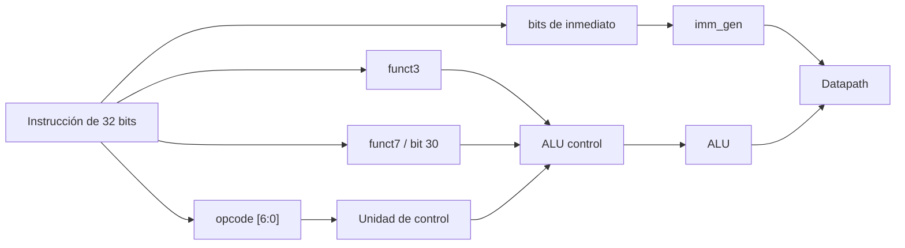

---

# 1. Formatos de instrucciones

Todas las instrucciones consideradas en este trabajo ocupan **32 bits**. Lo que cambia entre formatos es el significado de cada campo.

Los nombres más comunes son:

| Campo | Significado |
|---|---|
| `opcode` | Familia principal de la instrucción |
| `rd` | Registro destino |
| `rs1` | Primer registro fuente |
| `rs2` | Segundo registro fuente |
| `funct3` | Campo adicional para distinguir operaciones |
| `funct7` | Campo adicional para distinguir operaciones |
| `imm` | Valor inmediato codificado en la instrucción |

---

## 1.1. Formato I — Immediate

El formato I se utiliza cuando la instrucción necesita normalmente:

- un registro fuente `rs1`,
- un inmediato de 12 bits,
- y un registro destino `rd`.

### Distribución de bits

| Bits | 31:20 | 19:15 | 14:12 | 11:7 | 6:0 |
|---|---|---|---|---|---|
| Campo | `imm[11:0]` | `rs1` | `funct3` | `rd` | `opcode` |

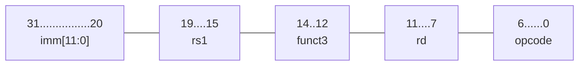

El inmediato es de 12 bits. Para operaciones aritméticas comunes se interpreta en complemento a dos y se **extiende con signo** a 32 bits.

### Ejemplo: `addi`

```asm
addi x5, x3, 10
```

Conceptualmente:

```text
x5 = x3 + 10
```

- `rs1 = x3`
- `rd = x5`
- `imm = 10`
- `opcode` identifica la familia I-ALU.
- `funct3` determina que la operación es `addi`.

### Uso del formato I en este proyecto

El mismo formato físico se reutiliza para operaciones distintas:

```text
I-ALU : addi, andi, ori, xori, slti, sltiu, slli, srli, srai
LOAD  : lb, lh, lw, lbu, lhu
JALR  : jalr
```

Por eso **formato I no significa necesariamente “operación aritmética inmediata”**.

### Reconstrucción del inmediato

```verilog
imm = {{20{instr[31]}}, instr[31:20]};
```

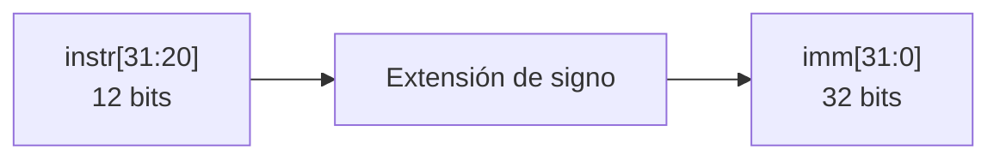

---

## 1.2. Formato S — Store

El formato S se utiliza para almacenar información desde un registro hacia memoria.

### Distribución

| Bits | 31:25 | 24:20 | 19:15 | 14:12 | 11:7 | 6:0 |
|---|---|---|---|---|---|---|
| Campo | `imm[11:5]` | `rs2` | `rs1` | `funct3` | `imm[4:0]` | `opcode` |


A diferencia del formato I:

- no existe `rd`;
- el inmediato está dividido en dos partes;
- `rs2` contiene el dato que será escrito en memoria.

### Ejemplo

```asm
sw x5, 8(x10)
```

Conceptualmente:

```text
dirección = x10 + 8
Memoria[dirección] = x5
```

Por lo tanto:

- `rs1 = x10`: dirección base.
- `rs2 = x5`: dato a almacenar.
- `imm = 8`: desplazamiento.
- `funct3`: distingue `sb`, `sh` y `sw`.

### Reconstrucción

```verilog
imm = {{20{instr[31]}},
       instr[31:25],
       instr[11:7]};
```

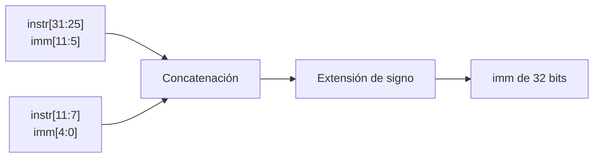

---

## 1.3. Formato B — Branch

El formato B se utiliza para **ramificaciones condicionales**.

También puede aparecer denominado **SB-type**.

### Distribución

| Bits | 31 | 30:25 | 24:20 | 19:15 | 14:12 | 11:8 | 7 | 6:0 |
|---|---|---|---|---|---|---|---|---|
| Campo | `imm[12]` | `imm[10:5]` | `rs2` | `rs1` | `funct3` | `imm[4:1]` | `imm[11]` | `opcode` |


El inmediato aparece “desordenado” porque sus bits están repartidos en distintas posiciones de la instrucción.

### Ejemplo: `beq`

```asm
beq x5, x6, etiqueta
```

Operación:

```text
si x5 == x6:
    PC = PC + inmediato
si no:
    PC = PC + 4
```

### Reconstrucción

```verilog
imm = {{19{instr[31]}},
       instr[31],
       instr[7],
       instr[30:25],
       instr[11:8],
       1'b0};
```

El `1'b0` final representa `imm[0]`.

Ese bit no se guarda explícitamente porque los destinos de branch están alineados al menos a múltiplos de 2 bytes. Por ello el desplazamiento reconstruido siempre tiene:

```text
imm[0] = 0
```

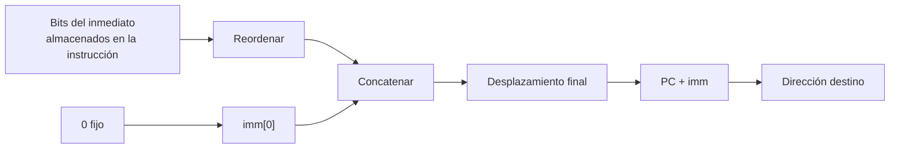

---

## 1.4. Formato J — Jump

El formato J se utiliza para `jal`.

También puede aparecer denominado **UJ-type**.

### Distribución

| Bits | 31 | 30:21 | 20 | 19:12 | 11:7 | 6:0 |
|---|---|---|---|---|---|---|
| Campo | `imm[20]` | `imm[10:1]` | `imm[11]` | `imm[19:12]` | `rd` | `opcode` |


`jal` hace dos operaciones:

1. guarda la dirección de retorno `PC + 4`;
2. modifica el PC para realizar el salto.

### Ejemplo

```asm
jal x1, etiqueta
```

```text
x1 = PC + 4
PC = PC + inmediato
```

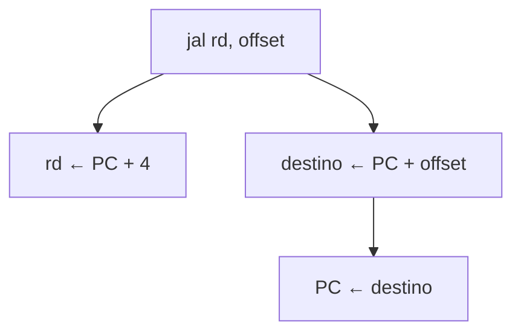

### Reconstrucción

```verilog
imm = {{11{instr[31]}},
       instr[31],
       instr[19:12],
       instr[20],
       instr[30:21],
       1'b0};
```

Al igual que en B-type, `imm[0]` es implícitamente `0`.

---

## 1.5. Formato U — Upper Immediate

El formato U contiene un inmediato grande de 20 bits.

### Distribución

| Bits | 31:12 | 11:7 | 6:0 |
|---|---|---|---|
| Campo | `imm[31:12]` | `rd` | `opcode` |

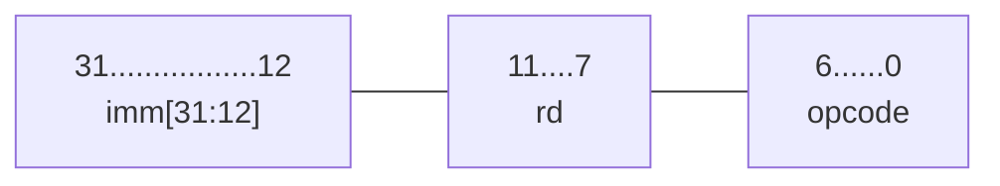

En este trabajo se utiliza para `lui`.

### Ejemplo

```asm
lui x5, 0x12345
```

Resultado:

```text
x5 = 0x12345000
```

Formalmente:

```text
rd = inmediato20 << 12
```

### Reconstrucción

```verilog
imm = {instr[31:12], 12'b0};
```

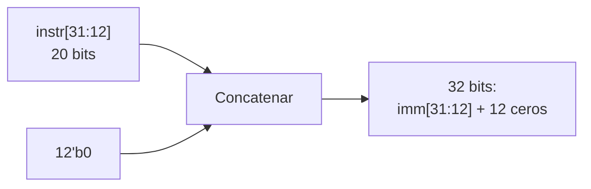

---

# 2. ¿Qué es el `opcode`?

`opcode` significa **operation code**.

En las instrucciones estudiadas es:

```verilog
instr[6:0]
```

Es decir, ocupa **7 bits**.

Su función principal es indicar qué **familia de instrucciones** debe interpretar el procesador.

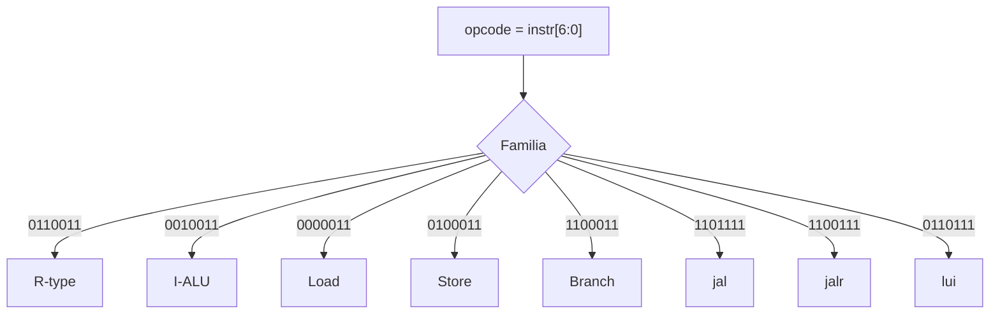

### Ejemplo

Si:

```text
opcode = 0110011
```

el procesador sabe que se trata de una operación **registro-registro**.

Pero el `opcode` no alcanza para saber si la instrucción exacta es:

```text
add
sub
and
or
xor
sll
srl
sra
slt
sltu
```

Para eso se consultan además:

```text
funct3
funct7
```

Por lo tanto:

```text
opcode              → familia principal
opcode + funct3     → operación más específica
opcode + funct3
       + funct7     → operación exacta cuando es necesario
```

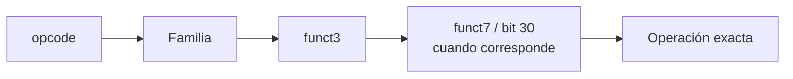

---

# 3. Familias e instrucciones utilizadas en el proyecto

---

## 3.1. Instrucciones R — Registro a registro

Las instrucciones R realizan operaciones entre dos valores provenientes del banco de registros.

Forma conceptual:

```text
rd = f(rs1, rs2)
```

### Ejemplo

```asm
add x5, x6, x7
```

```text
x5 = x6 + x7
```

### Flujo de datos

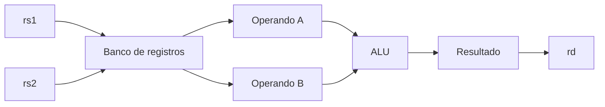

### Instrucciones R requeridas

```text
add
sub
sll
srl
sra
and
or
xor
slt
sltu
```

### Formato R

Aunque no era uno de los formatos pedidos inicialmente, estas instrucciones usan:

| 31:25 | 24:20 | 19:15 | 14:12 | 11:7 | 6:0 |
|---|---|---|---|---|---|
| `funct7` | `rs2` | `rs1` | `funct3` | `rd` | `opcode` |

---

## 3.2. Instrucciones I-ALU

Estas instrucciones utilizan:

- un registro `rs1`;
- un inmediato;
- un registro destino `rd`.

Forma:

```text
rd = f(rs1, inmediato)
```

### Ejemplo

```asm
addi x5, x6, 10
```

```text
x5 = x6 + 10
```

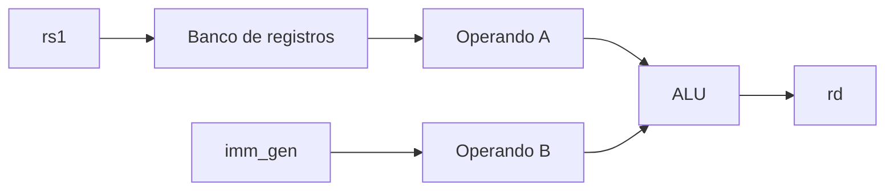

### Instrucciones requeridas

```text
addi
andi
ori
xori
slti
sltiu
slli
srli
srai
```

### Atención con `funct7[5]` / bit 30

`add/sub` y `srl/sra` pueden distinguirse usando información del bit 30, pero no debe tratarse ese bit indiscriminadamente como si siempre fuera un `funct7`.

Por ejemplo:

```asm
addi x1, x0, -1
```

tiene bits altos del inmediato en `1`, pero eso **no convierte** a `addi` en una resta.

---

## 3.3. Instrucciones Load

Las instrucciones `load` transfieren información desde memoria hacia un registro.

```text
Memoria → Registro
```

### Ejemplo

```asm
lw x5, 8(x10)
```

Primero se calcula:

```text
dirección = x10 + 8
```

Luego:

```text
x5 = Memoria[dirección]
```

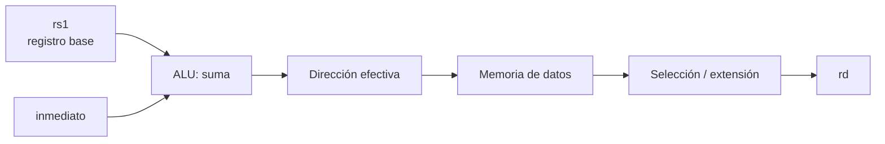

### Loads del proyecto

| Instrucción | Tamaño | Extensión |
|---|---:|---|
| `lb` | 8 bits | signo |
| `lh` | 16 bits | signo |
| `lw` | 32 bits | — |
| `lbu` | 8 bits | cero |
| `lhu` | 16 bits | cero |

Todos utilizan **formato I**.

---

## 3.4. Instrucciones Store

Los `store` realizan el camino inverso:

```text
Registro → Memoria
```

### Ejemplo

```asm
sw x5, 8(x10)
```

```text
dirección = x10 + 8
Memoria[dirección] = x5
```

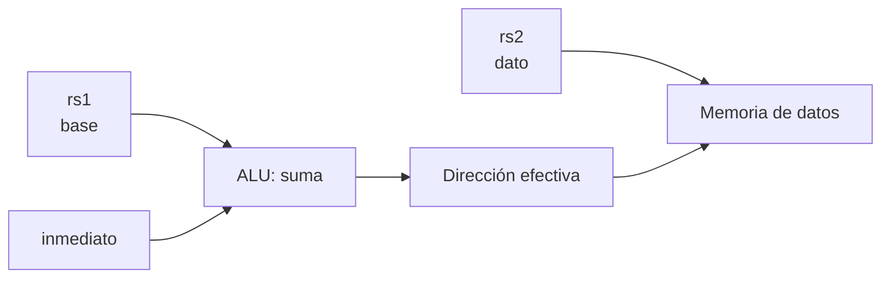

### Stores del proyecto

```text
sb → 8 bits
sh → 16 bits
sw → 32 bits
```

Utilizan **formato S**.

---

## 3.5. Instrucciones Branch

Las instrucciones branch cambian el flujo del programa solamente cuando se cumple una condición.

En este trabajo:

```text
beq
bne
```

### `beq`

```asm
beq x5, x6, etiqueta
```

```text
si x5 == x6:
    PC = PC + imm
si no:
    PC = PC + 4
```

### `bne`

```text
si x5 != x6:
    PC = PC + imm
si no:
    PC = PC + 4
```

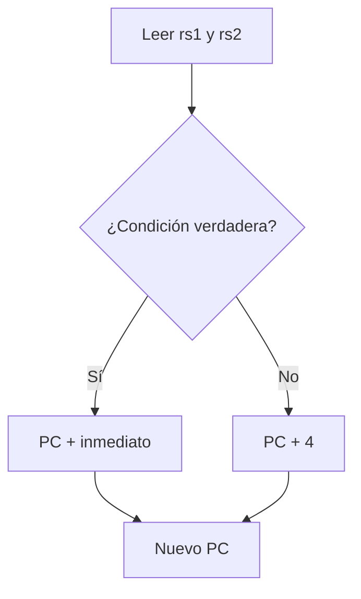

Utilizan **formato B**.

En un pipeline, si el branch se resuelve después de que ya ingresaron instrucciones posteriores, un salto tomado obliga a **descartar las instrucciones del camino incorrecto** mediante `flush`.

---

## 3.6. `jal` — Jump And Link

`jal` significa **Jump And Link**.

Realiza un salto incondicional relativo al PC y guarda una dirección de retorno.

```asm
jal rd, offset
```

Operación:

```text
rd = PC + 4
PC = PC + offset
```

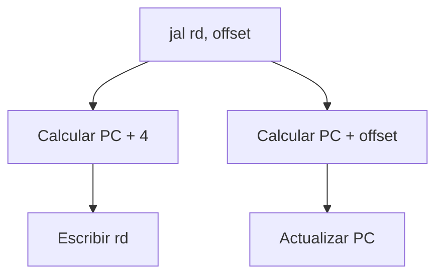

### Ejemplo de llamada

```asm
jal x1, funcion
```

`x1` puede guardar la dirección de retorno.

### Salto sin guardar retorno

```asm
jal x0, etiqueta
```

Como `x0` permanece siempre en cero, `PC + 4` se descarta.

`jal` utiliza **formato J**.

---

## 3.7. `jalr` — Jump And Link Register

`jalr` también guarda una dirección de retorno, pero calcula el destino usando un registro.

```asm
jalr rd, imm(rs1)
```

Realiza:

```text
rd = PC + 4
PC = (rs1 + imm) & ~1
```

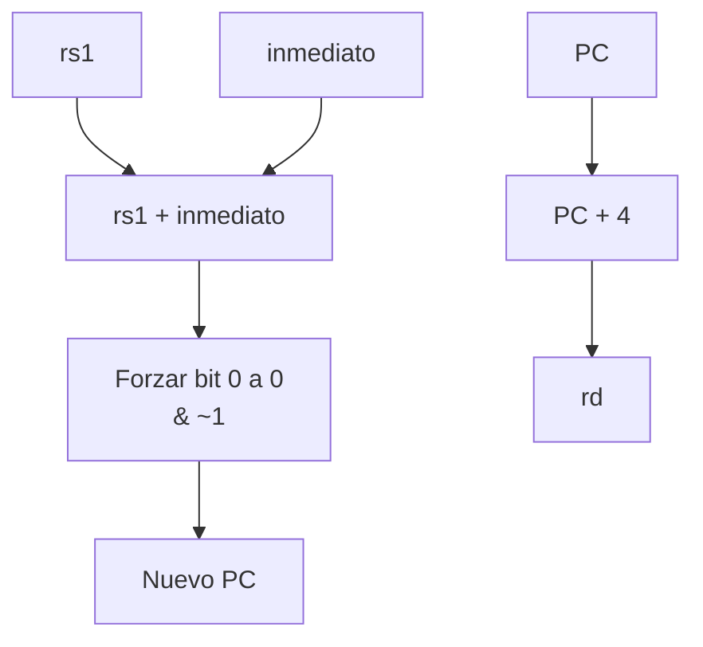

### Ejemplo de retorno

```asm
jalr x0, 0(x1)
```

Si `x1` contiene la dirección de retorno:

```text
PC ← x1
```

y como `rd = x0`, no se conserva un nuevo enlace.

Aunque es una instrucción de salto, utiliza **formato I**.

---

## 3.8. `lui` — Load Upper Immediate

`lui` significa **Load Upper Immediate**.

Carga un inmediato de 20 bits en la parte alta del registro destino.

```asm
lui x5, 0x12345
```

Resultado:

```text
x5 = 0x12345000
```

Formalmente:

```text
rd = imm20 << 12
```

```mermaid
flowchart LR
    IMM20["Inmediato de 20 bits\n0x12345"] --> SHIFT["Desplazar 12 bits\n(o concatenar 12 ceros)"]
    SHIFT --> VALUE["0x12345000"]
    VALUE --> RD["rd"]
```

Utiliza **formato U**.

Una aplicación típica es construir constantes grandes combinando:

```asm
lui
addi
```

---

## 3.9. HALT

En RV32I no existe una instrucción estándar `HALT` con exactamente la semántica de parada que necesita este trabajo.

Sin embargo, la consigna exige una instrucción de parada, por lo que el proyecto debe **definir una codificación y una política de detención**.

La hoja de ruta propone como opción utilizar:

```text
0x00000073
```

que corresponde a la codificación de `ecall`, y hacer que **este procesador del proyecto la interprete como HALT**.

> Importante: en RISC‑V estándar, `ecall` no significa literalmente “detener el procesador”; esta interpretación es una decisión de diseño específica del trabajo.

### Ejemplo de detección

```verilog
localparam [31:0] HALT = 32'h0000_0073;

wire is_halt_id = valid_id && (instr_id == HALT);
```

### Idea de funcionamiento propuesta

1. HALT llega a ID.
2. Se impide buscar nuevas instrucciones.
3. Las instrucciones anteriores siguen avanzando.
4. HALT continúa desplazándose por el pipeline.
5. Cuando HALT llega a WB, las instrucciones anteriores ya terminaron.
6. Se activa `halted`.

```mermaid
flowchart LR
    IF["IF"] --> ID["ID\nDetectar HALT"]
    ID --> EX["EX"]
    EX --> MEM["MEM"]
    MEM --> WB["WB\nhalted = 1"]

    ID -. "detener nuevas búsquedas" .-> STOP["Fetch detenido"]
```

Esto permite que al finalizar el programa el pipeline quede lógicamente vacío de instrucciones útiles anteriores.

---

# 4. Relación completa entre formato e instrucción

| Familia / instrucción | Formato | Operand(os) fuente | Destino |
|---|---|---|---|
| R | R | `rs1`, `rs2` | `rd` |
| I-ALU | I | `rs1`, inmediato | `rd` |
| Load | I | `rs1`, inmediato, memoria | `rd` |
| Store | S | `rs1`, `rs2`, inmediato | memoria |
| Branch | B | `rs1`, `rs2`, inmediato | PC |
| `jal` | J | PC, inmediato | `rd` y PC |
| `jalr` | I | `rs1`, inmediato, PC | `rd` y PC |
| `lui` | U | inmediato | `rd` |
| HALT | elección del proyecto | — | control del CPU |

```mermaid
flowchart TD
    INST["Instrucción 32 bits"] --> OP["opcode"]
    OP --> R["R-type"]
    OP --> I["I-type"]
    OP --> S["S-type"]
    OP --> B["B-type"]
    OP --> J["J-type"]
    OP --> U["U-type"]
    OP --> H["HALT / codificación elegida"]

    R --> RR["ALU: rs1 y rs2"]
    I --> II["ALU inmediata / Load / jalr"]
    S --> SS["Store"]
    B --> BB["Branch"]
    J --> JJ["jal"]
    U --> UU["lui"]
    H --> HH["Detener fetch y vaciar pipeline"]
```

---

# 5. Resumen conceptual para la Fase 1

La idea central puede resumirse así:

```text
opcode
    ↓
identifica la familia

formato
    ↓
indica dónde están rs1, rs2, rd e inmediato

funct3 / funct7
    ↓
permiten identificar la operación exacta

imm_gen
    ↓
reconstruye y extiende el inmediato

alu_control
    ↓
genera la operación interna de la ALU
```

```mermaid
flowchart LR
    INST["instr[31:0]"] --> OP["opcode"]
    INST --> F["funct3 / funct7"]
    INST --> IB["bits de inmediato"]

    OP --> CONTROL["control"]
    OP --> IGEN["imm_gen"]
    IB --> IGEN

    CONTROL --> ACTRL["alu_control"]
    F --> ACTRL

    IGEN --> DATAPATH["Datapath"]
    ACTRL --> ALU["ALU"]
    ALU --> DATAPATH
```

Una separación mental útil para implementar el procesador es:

> **El `opcode` me dice qué clase de instrucción tengo.**  
> **El formato me dice dónde están sus campos.**  
> **`funct3` y `funct7` me dicen qué operación concreta debo realizar.**

---

# 6. Fuentes utilizadas

1. David A. Patterson, John L. Hennessy, *Computer Organization and Design: The Hardware/Software Interface — RISC‑V Edition*. Especialmente los capítulos sobre representación de instrucciones, datapath y control.
2. **Trabajo Final 2026 — Pipeline Procesador (RISC‑V)**, material de la cátedra.
3. **Hoja de ruta del pipeline RISC‑V**, especialmente:
   - Fase 1: ALU, `imm_gen` y unidad de control.
   - Fase 6: saltos y flush.
   - Fase 7: HALT y vaciado del pipeline.

---

## Nota sobre Mermaid

Los bloques `mermaid` son diagramas definidos completamente como texto Markdown. GitHub puede renderizarlos directamente. Si el visor Markdown que utilizás no soporta Mermaid, el código del diagrama seguirá siendo visible como texto y puede abrirse en cualquier editor compatible con Mermaid.
